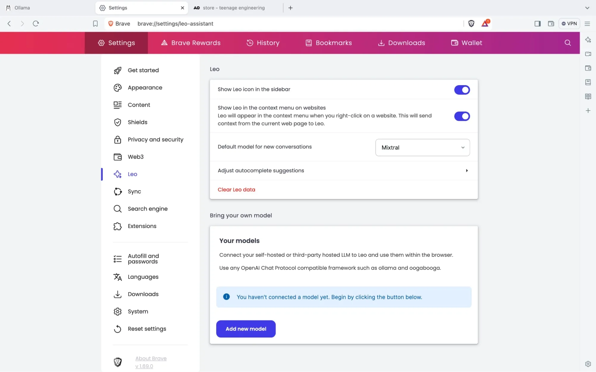
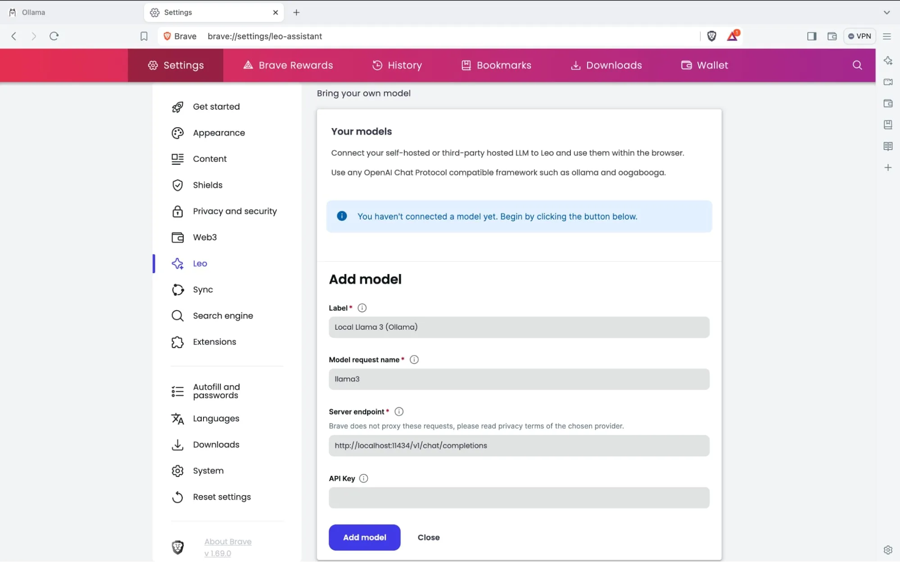
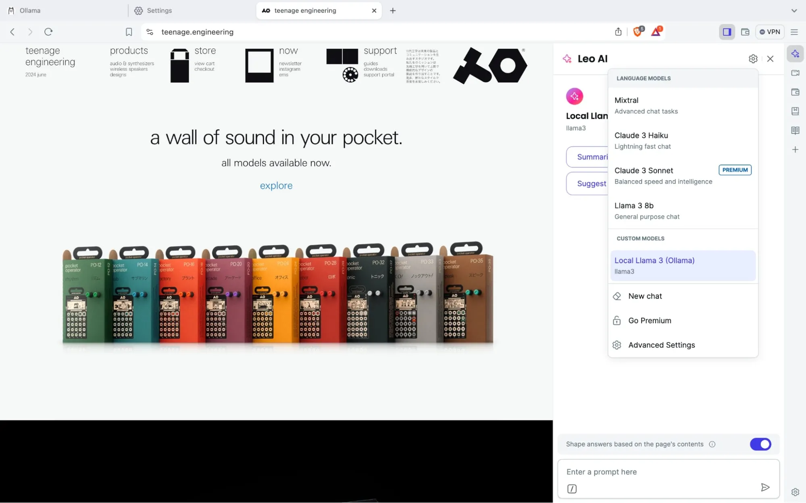

متصفح Brave اضاف مؤخرا [القدرة على استضافة مساعد LEO محليا](https://brave.com/blog/byom-nightly/) باستخدام Ollama
 
هذا شرح قصير عن تشغيل LEO محليا بستخدام برمجية Ollama على دوكر.
استخدام دوكر يسهل تثبيت Ollama خاصة على كروت AMD, لان سيختصر كل اعداد التعريفات

## Ollama اعداد 

### CPU
```yaml
services:
  ollama:
    image: ollama/ollama
    volumes:
      - ./ollama:/root/.ollama
    ports:
      - "11434:11434"
```

### ROCm
```yaml
services:
  ollama:
    image: ollama/ollama:rocm
    devices:
      - /dev/kfd:/dev/kfd
      - /dev/dri:/dev/dri
    # environment:
    #   - HSA_OVERRIDE_GFX_VERSION=10.3.0 # for unsupported gpus such as 6700xt, 7800xt etc.
    volumes:
      - ./ollama:/root/.ollama
    ports:
      - "11434:11434"
```

### CUDA
ستحتاج لتثبيت ادوات أنڤيديا للحاويات (nvidia container toolkit) كامل التفاصيل موجوده على [صفحة Ollama على docker hub](https://hub.docker.com/r/ollama/ollama).

```yaml
services:
  container_name: ollama
  ollama:
    deploy:
      resources:
        reservations:
          devices:
            - driver: nvidia
              count: all
              capabilities:
                - gpu
    volumes:
      - ollama:/root/.ollama
    ports:
      - 11434:11434
    image: ollama/ollama
```

## Downloading an LLM
ستحتاج لاختيار موديل يتسع على ذاكرة كرت الشاشة الخاص بك.
هناك نسخ "quantized" من LLMs تكون اصغر وتعمل بذاكرة اقل.
ادخل الى صفحة الLLM وابحث في قائمة الاصدارات عن نسخه تتسع على الكرت الخاص بك.

بامكانك معرفة ابرز الLLMs على صفحة Lmsys's chatbot arena Leaderboard, ترتب الموديلات على حسب تقييمات المستخدمين.
https://lmarena.ai/

موديلات LLAMA 3 من ميتا هي الاشهر الحاليا.

```bash
docker exec -it ollama bash
~# ollama pull llama3:YOUR_TAG
```
هذا الامر سيقوم بتنزيل الموديل الى مجلد `./ollama` المربوط في دوكر.

## استخدام LEO مع الموديل المحلي
أذهب الى الاعدادات ثم صفحة Leo

(صور من Brave)

ال model request name هو نفس اسم الموديل في Ollama, أي: `llama3:YOUR_TAG`

عنوان الخادم سيكون دائما: `http://localhost:11434/v1/chat/completions` الا اذا تستضيف Ollama على خادم اخر او غيرت المنفذ.



تاكد من اختيار الموديل المحلي عند استخدام leo.


والان اصبح لديك مساعد ذكاء اصطناعي مدمج في المتصفح ويعمل محليا مع خصوصية تامه!