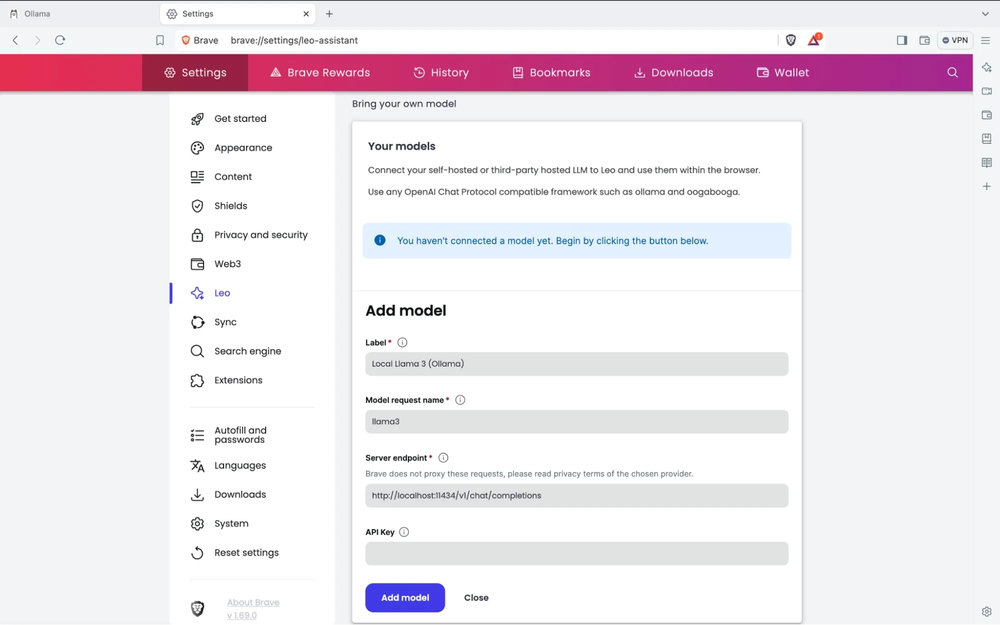

Brave recently introduced [the ability to bring your own model](https://brave.com/blog/byom-nightly/) to use with LEO using other third party providers or a local model using Ollama!
 
This is a quick guide to hosting Ollama with docker and integrating it with Leo.
I'm doing this with docker because it's much easier for AMD GPUs, because you don't need any drivers to make it work.

## Ollama setup

### CPU
```yaml
services:
  ollama:
    image: ollama/ollama
    volumes:
      - ./ollama:/root/.ollama
    ports:
      - "11434:11434"
```

### ROCm
```yaml
services:
  ollama:
    image: ollama/ollama:rocm
    devices:
      - /dev/kfd:/dev/kfd
      - /dev/dri:/dev/dri
    # environment:
    #   - HSA_OVERRIDE_GFX_VERSION=10.3.0 # for unsupported gpus such as 6700xt, 7800xt etc.
    volumes:
      - ./ollama:/root/.ollama
    ports:
      - "11434:11434"
```

### CUDA
You will need to install the nvidia container toolkit and enable it for docker, see the [docker hub page](https://hub.docker.com/r/ollama/ollama) for Ollama for details.

```yaml
services:
  container_name: ollama
  ollama:
    deploy:
      resources:
        reservations:
          devices:
            - driver: nvidia
              count: all
              capabilities:
                - gpu
    volumes:
      - ollama:/root/.ollama
    ports:
      - 11434:11434
    image: ollama/ollama
```

## Downloading an LLM
You need to choose a model that fits into your GPU's VRAM.
Remember that there are smaller "quantized" versions of most LLMs, you could just scroll down the tag picker on Ollama's site until you see something that might fit your GPU.

You can find the state-of-the-art models using the Lmsys's chatbot arena Leaderboard, which ranks most Ai models depending on how users like them.
https://lmarena.ai/

Meta AI's LLama 3 models are currently by far the most popular models on Ollama.

```bash
docker exec -it ollama bash
~# ollama pull llama3:YOUR_TAG
```
This will download the model to the mounted `./ollama` directory.

## Using Leo with Ollama
Go to settings and then to the Leo page

(pictures courtesy of brave)

The model request name is the same as the one in Ollama, so `llama3:YOUR_TAG`

the server endpoint will always be: `http://localhost:11434/v1/chat/completions` unless you host Ollama somewhere else.



And then select the model when using leo, 


And now you have your own local AI assistant built into your browser!