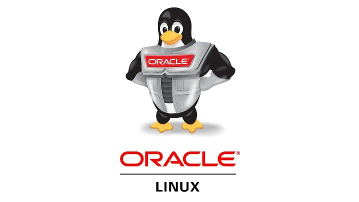

**هذا المقال كُتب على مجتمع أسس [هنا](https://discourse.aosus.org/t/topic/2832)**

نكمل أسبوع مليء من الدراما في عالم البرمجيات المفتوحة بعد قرار شركة Red hat الأخير بايقاف نشر مصدر توزيعة RHEL للعامة.
ذكرت كامل التفاصيل في هذا الموضوع
https://discourse.aosus.org/t/topic/2819/

وهذا القرار يستهدف بشكل واضح التوزيعات التي تقوم بتقديم نسخه مطابقه بالكامل لRHEL, اي تعطي نسخه مجانيه من عمل مدفوع.
وابرز هذه التوزيعات هي Rocky Linux و Almalinux, بالإضافة الى توزيعات اخرى مثل Oracle Linux و Cloudlinux, والان قدمت معظم التوزيعات خططها للتعامل مع هذا التغيير.

## خطة Rocky Linux
فريق Rocky linux عمومًا علاقته مع شركة Red hat ليست إيجابية, ويظهر هذا بطريقة تعاملهم مع هذا القرار, في مقال "Keeping Open Source open"
https://rockylinux.org/news/keeping-open-source-open/

أذ ان خطتهم هي التلاعب على الحدود والحصول على مصدر RHEL بالطرق الأتية:

- استخدام صور حاويات UBI لRHEL المتوفرة على مستودعات مثل Docker hub لاستخراج المصدر, وحسب كلامهم هذه الطريقة تعمل جيدا دون اي تعقديات
- أستخدام خوادم من شركات الاستضافة التي توفر خوادم مع اشتراكات RHEL, واستخراج المصدر منها

وهذه الطرق قانونية, لانه أعادة النشر ممكنه بسبب ترخيص الGPL, وان هذه الطرق لا تجبر المستخدم على الموافقة على شروط حسابات Red hat. 
وهذه الطرق يمكن تغييرها مع الوقت لتتعامل مع اي تعقيدات قد تفرضها شركة Red hat.

## خطة Almalinux
https://almalinux.org/blog/our-value-is-our-values/

رد فريق توزيعة Almalinux في مقالة "Our Value is our Values" كان اكثر احترافية, حيث لم يخططو للتلاعب حول اي حدود, أنما تجميع التحديثات من توزيعة CentOS stream و Oracle Linux, ومحاوله تطبيقها على توزيعة Almalinux.
هذه الطريقة تطلب مجهود عالي, ولن تكون مباشرة مثل اعادة بناء حزمه مباشرة سابقا, كمثال كان هناك فرق 3 ايام في تحديث امني لحزمة OpenSSL بين توزيعة Almalinux و RHEL بعد بدء العمل بهذه الطريقة.

ركزت التوزيعة في  المقال إيضاح قيمه التوزيعات التي تقوم بنسخ RHEL للمجتمع, من دعم مالي لمشاريع مثل Fedora  و CentOS بالإضافة لمؤتمرات مثل Opensuse CONF, او المساهمة بمشاريع برمجيه تساعد بتطوير RHEL و CentOS ودعم معماريات جديدة مثل aarch64 واجهزه مثل Raspberry pi.

## ماذا عن التوزيعات الاخرى؟
ذكرنا توزيعات اخرى مثل Oracle Linux و Cloudlinux, ما كنت ردودهم؟

### Cloudlinux
https://blog.cloudlinux.com/cloudlinux-os-8-and-9-in-post-redhat-world
توزيعة Cloudlinux هي نسخه مدفوعة من RHEL مركزة على قطاع الاستضافة, ويقدمون دعمهم الخاص للمشتركين.
بمدونتهم, أوضحت الشركة أن التوزيعة ستكمل فترة دعم 10 سنين المتوقعة, وسيشمل الدعم حلول العلل و حلول العلل الأمنية لكل الحزم المتعلقة بقطاع الاستضافة, وذكرو ان لديهم خبرات سابقة في تقديم الحلول لحزم قديمة مثل دعم توزيعة Cloudlinux 6 بتحديثات امنيه حتى بعد توقف دعم CentOS 6, وتقديم حلول امنيه لإصدار php 4.0 المتوقف دعمه رسميا.
ولتمكين التوزيعة من مواكبه التحديثات بشكل افضل, الشركة ستبدأ بزيادة حجم فريقها.

أيضا التوزيعة ستقوم باستخدام اصدار نواة احدث من نواة rhel الرسمية لدعم عتاد اكثر.

#### تقديم نسخه مجانية
ستقدم التوزيعة نسخه مجانيه ستحتوي على نفس التحديثات, لكن دون ميزات مدفوعة مثل LVE, CageFS, AccelerateWP, HardenedPHP وغيرها.
وستكون هناك طريقة مباشرة للانتقال من Alma/rocky linux للنسخه المجانية.

### Oracle Linux

**تحديث: صدر رد Oracle**
https://discourse.aosus.org/t/topic/2838

شركة Oracle ايضا تقدم نسخه من RHEL, مع دعم منها منافس لRed hat, والتوزيعة مشهوره بين الشركات التي تستخدم منتجات Oracle مثل Oracle DB.
لحد الان لم يصدر اي تعليق رسمي من الشركه حول التغييرات ومصير التوزيعة, لكن المتوقع ان تبقى التوزيعة تعمل مع صرف مجهود اكبر من شركة Oracle عليها, او التلاعب على الحدود, خاصة ان شركة Oracle معروفة بحبها للقضايا والمحاكم, وتاريخها الحافل مع Red hat.

## التغيير بسبب تصرفات بعض التوزيعات
 م. Mike Mcgrat, كتب على Reddit ان التغيير كان بسبب تصرفات بسوء ظن من احد النسخ, وبحثو عن حل واختارو ايقاف نشر مصدر RHEL للعامة.

https://reddit.com/r/AlmaLinux/comments/14jsb52/red_hats_commitment_to_open_source_a_response_to/jpqm7c8/

وفي تعليقات اخرى يذكر ان Red hat لا تريد ايقاف النسخ تماما, لكن بنفس الوقت يجب على الشركة المدافعة عن مصالحها و استمراريتها, ولا يجب عليهم جعل عمليه نسخ التوزيعة سهله جدا.
ويقول ان أثبات على هذا ان Red hat سرحت عدد من الموظفين و لم يهتم احد, لكن عندما توقف نشر مصدر RHEL للمحافظة على مصالحة الشركة واستمراريتها, أعترض الجميع.

ويذكر انه هو كاتب المقالتين على موقع Red hat عن هذا القرار, الأخيرة يدافع فيها عن قرار الشركة ويوضح ان نسخ RHEL لا تقدم اي قيمة كافيه للتغاضي عن عدد المستخدمين الذين يستخدمون التوزيعات الناسخة من RHEL كبديل للدفع للشركة مقابل عملهم.
https://www.redhat.com/en/blog/red-hats-commitment-open-source-response-gitcentosorg-changes

ايضا يذكر البعض ان هذا التغيير ليس تغيير كبير, لان التحديثات لم تكن مباشرة ل git.centos.org (المصدر السابق لRHEL), وكانت تأخذ وقت, وهو نفس ما يحصل مع Stream.

https://twitter.com/_msw_/status/1675162141702373376

مارايكم؟ هل ترون قرار Red hat عادل؟ ويعدّ دفاع عن الشركة ومصالحها؟ ام خيانه للقيم البرمجيات المفتوحة والحرة التي جعلت شركة Red hat و توزيعة RHEL على ما هي الان؟

