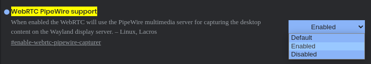

If you use a distro with wayland, you might have noticed, that screen sharing might not work, it will probably show a black box, instead of your display

## Why

This is because Wayland doesn't give the premission for a program to capture the screen the same way X.ORG does.

Since your distro/Desktop environment uses Wayland, it probably uses Pipwire too, we will use it to share our screen.

## Make Chromium use Pipewire
open your chromium browser and open this link `chrome://flags/#enable-webrtc-pipewire-capturer`

and Then just restart your browser from the restart option, and you should be ok.

## notes

Its still not seamless though, when you share your screen, there will be two pop ups instead of only one.
one from the browser and then one from Pipewire.

And when you select your screen, its going to prompt you to select it again when its actually going to share it to the application, and not just preview it.

As for Electron apps, this Option should be enabled by default on new version, however on old ones, you might need to find away to enable it manually.

But most electron apps have a web version anyway, so just use it instead of the app!