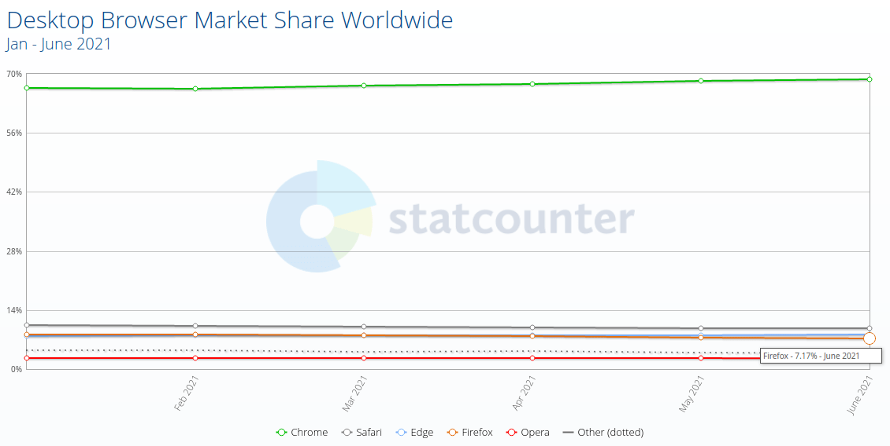

**هذا المقال كُتب على مجتمع أسس, كامل التعليقات [هنا](https://discourse.aosus.org/t/topic/2048)**

كشفت تقراير حصه المتصفحات السوقيه عن احتمال
خساره فايرفوكس 12-20% من مستخدمينه خلال عام 2021 فقط

موزيلا اخر فتره كانت تقوم بقرارت سيئه
بدايه من طرد اكثر من 25% من المطورين لكن بنفس الوقت، [اعطاء علاوه قدرها 2.4 مليون دولار لمديرة موزيلا](https://fosspost.org/mozilla-go-unfck-yourself/)
وخلال عام 2021 حسب احصائات statcounter
نزلت حصه فايرفوكس السوقيه من `%8.1` الى `%7.1`
مما يعني خساره 12% من المستخدمين خلال 6 أشهر

لكن هناك عده احصائيات لحصه المتصفحات، W3Schools تقول ان حصه فايرفوكس انخفضت من %4.1 الى `%3.3`، مما يعني خسارة 20% من المستخدمين خلال 6 اشهر فقط

يذكر ان هذه الاحصائيات اغلبيه المستخدمين العظمى فيها هم من المكتبي،
لان فايرفوكس شبه غير موجود على الهواتف، [%0.35 فقط نسبه استخدام فايرفوكس على الهواتف](https://gs.statcounter.com/browser-market-share/mobile/worldwide/#monthly-202006-202106)

اما في احصائيات أسس(تتاثر بمانع الاعلانات ولا نستخدم google analytics هذه احصائيات خاصه بنا تهتم بالخصوصية، plausible)
ففايرفوكس يأتي بالمركز الثاني ب 25% من الزوار
بعد كروم/كروميم وهو بنسبه 53%
وسفاري بالمركز الثالث بنسبه 10%

ومستخدمين فايرفوكس 71% منهم على الحاسب، و %28 منهم على الهواتف واللوحيات.

## ما الاسباب ؟
برأي هذه اهم الاسباب
- فايرفوكس على الهاتف سيء وبطيء بشكل عام وفيه العديد من المشاكل مقارنه بمتصفحات كروميم ، والعديد من المستخدمين يفضلو استخدام نفس المتصفح لكل اجهزتهم.
- التصميم الجديد لم يعجب بعض المستخدمين بسبب اخذ مساحه اكبر من الشاشه
- عدم دعم تقنيات حديثه مثل PWA و ميزات مثلا backdrop-filter في css بينما بقيه المتصفحات دعمتهم من فتره طويله.
- خساره المستخدمين التقنيين الثقه في موزيلا بعد القرارات السيئه في الفتره الاخيره،
وزياده فرق الاداء [والامان](https://madaidans-insecurities.github.io/firefox-chromium.html) بين كروميم وفايرفوكس.
- سبب اخر من المستخدمين التقنيين وهو قرب موزيلا الزائد لجوجل، وعدم تقدميهم لبدائل تهتم بالخصوصية، عكس بريف مثلا الذي [يقدم محرك بحث مستقل](https://discourse.aosus.org/t/topic/1979) و شبكه اعلانات تحافظ على الخصوصية.

يذكر ان فايرفوكس يبقى الافضل بالخصوصية ****اذا قمت بتعديل عليه**** 
بحيث اصبح الان هناك متصفحات اخرى تهتم بالخصوصية مثل بريف واعداداتها الافتراضيه افضل من فايرفوكس بسبب وجود مانع اعلانات و تتبع بشكل افتراضي.

لكن يبقى فايرفوكس متقدم بالميزات اذا قمت بتفعليها مثل الحاويات وعزل الكوكيز، واعطاء ublock origin امكانيه حذف عناوين تتبع حتى مع cname-cloaking.

## اين يذهب المستخدمين؟

في نفس وقت نزول حصه فايرفوكس ارتفعت حصه مايكروسوفت Edge لتصل الى %8.1 ليتجاوز فايرفوكس.
لكن هذا لا يعني ان كل المستخدمين من فايرفوكس، لان بعد انتقال ايدج لكروميم هو في ارتفاع عام خلال اخر سنه.

وهناك احتمال ايضا ان يتجاوز Samsung browser متصفح على الهاتف فقط، نسبه فايرفوكس الكامله خلال الفتره القادمة.

وللاسف لا يظهر اي تغيير في توجه فايرفوكس وموزيلا.

ما رأيكم؟ هل تستخدمون فايرفوكس الان؟ ام انتقلتم لمتصفح اخر؟

## مصادر

https://Statcounter.com

https://fosspost.org/firefox-may-have-lost-12-percent-of-users/

احصائيات أسس