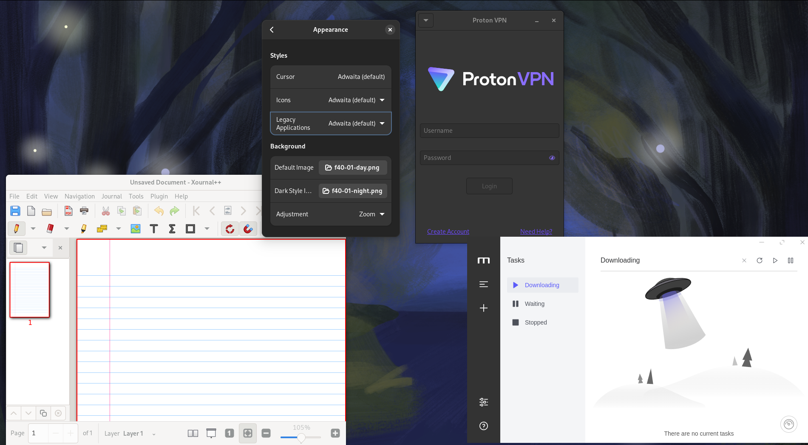
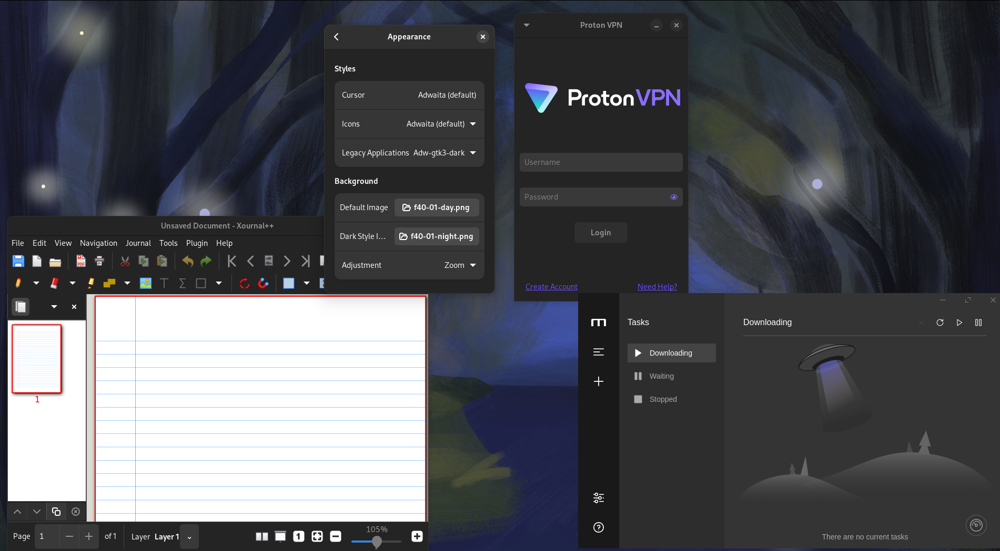
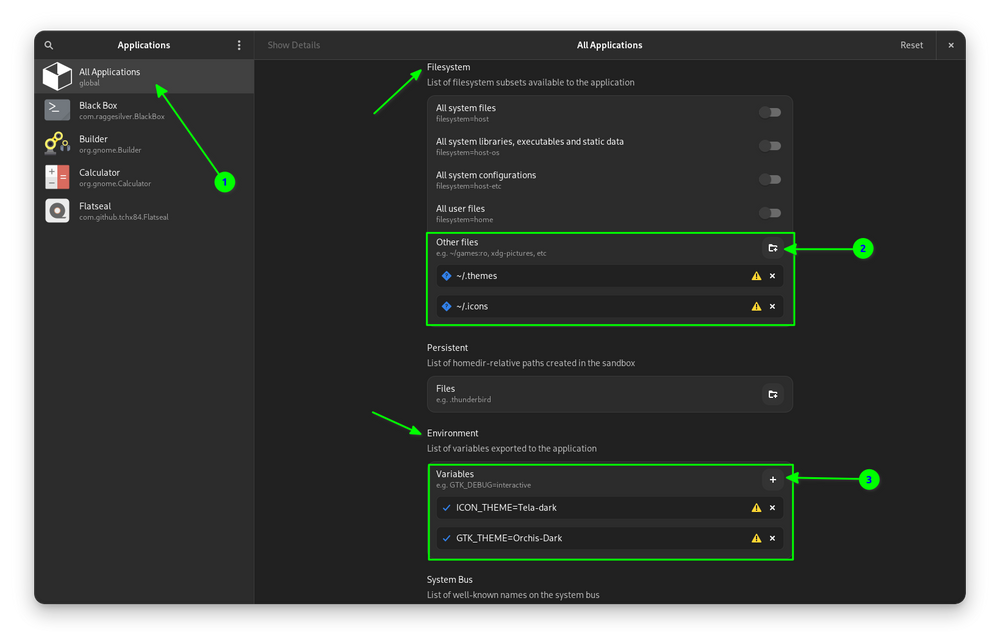
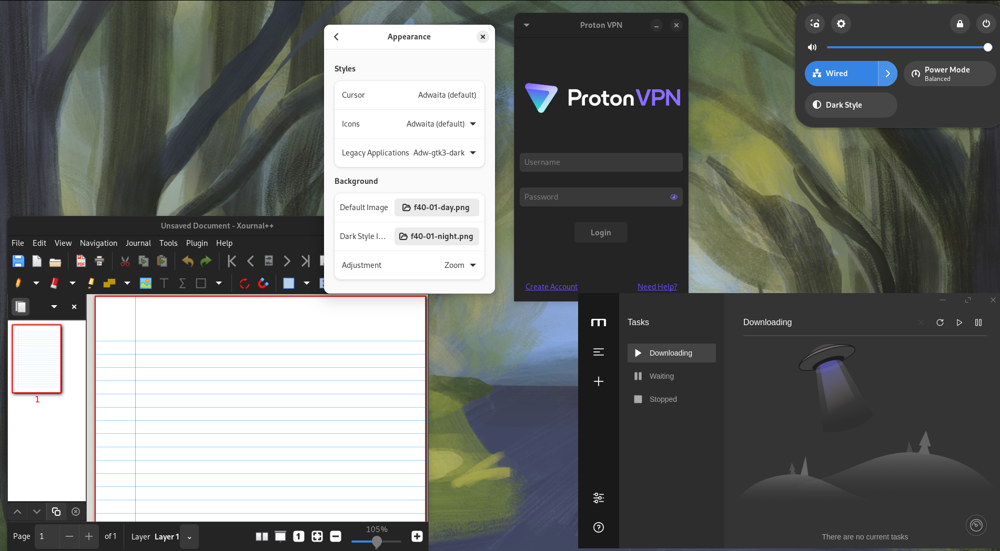

Flatpak هو اشهر صيغة تطبيقات عامة على لينكس, لكن لحد الان أواجه بعض المشاكل في تطبيق الوضع الداكن على التطبيقات.

لكن لحسن الحظ وجدت بعض الحلول الممكنة لهذه المشكلة.

## تاكد من وجود القوالب الداكنة للتطبيقات

بشكل افتراضي سيقوم Flatpak بالبحث عن القوالب التي تستخدمها وسيثبتها, لكن للتأكد, بإمكانك تثبيت القوالب يدويا:

قالب Adwaita:

```bash

flatpak install org.gtk.Gtk3theme.Adwaita-dark/x86_64/3.22

```

لقوالب Ubuntu:

داكن

```bash

flatpak install flathub org.gtk.Gtk3theme.Yaru-dark

```

فاتح

```bash

flatpak install flathub org.gtk.Gtk3theme.Yaru-light

```

لكن هذه القوالب الافتراضية, في اوبونتو هناك قوالب اخرى تعتمد على اللون الذي اخترته, مثلا اذا اخترت احمر, سيكون القالب Yaru-Red-dark.

لترى كل قوالب gtk3themes المتوفرة من Flathub باستخدام هذا الامر:

```bash

flatpak search gtk3theme

```

## إستخدم قالب Adwaita الافتراضي



إفتح تطبيق Gnome-tweaks وتاكد من استخدام قالب Adwaita.

لأنه يقدم افضل توافقية, و قام بحل بعض المشاكل لدي مثل عدم تطبيق الوضع الداكن على تطبيق Proton VPN.

## تطبيق الوضع الداكن يدويا

اذا لم تنجح الحلول السابقة, فعلى الأغلب التطبيقات التي تستخدمها لا تدعم المعايير المطلوبة, على الاقل ليس بشكل كامل.

هناك حلول عبر اجبار تطبيق الوضع الداكن, وهذه الحلول ستعطل مفعول تغيير من الوضع الفاتح والغامق من الإعدادات السريعة.

### استخدم قالب adw-gtk3



قالب adw-gtk3-dark, هو قالب يحاول تطبيق منظر مشابهه لgtk4 على تطبيقات gtk3.

ميزة اخرى هي انه يحل مشكلة الوضع الداكن في العديد من التطبيقات, مثل Xournal++, الذي لا يعمل فيه الوضع الداكن حتى مع adwaita-dark.

حتى تطبيقات Electron التي تستخدم اصدار قديم لا يدعم المعايير المطلوبة للتعرف على الواضع الليلي, تعمل مع adw-gtk3-dark.

[خطوات تثبيت adw-gtk3-dark](https://github.com/lassekongo83/adw-gtk3?tab=readme-ov-file#how-to-install)

## اجبار استخدام قالب داكن عبر Flatseal

اذا لم تعمل الحلول الأخر, بإمكانك ان تجبر البرمجية على استخدام قالب محدد باستخدام متغير `GTK_THEME`.



بإمكانك عمل هذا على كل التطبيقات او على تطبيق محدد.

هذه ابرز الحلول التي وجدتها, من تجربتي افضل حل هو استخدام قالب adw-gtk3, لكن لأنة اختيار يدوي, تغيير القالب عبر **الزر في جنوم لن يؤثر على هذه التطبيقات**



## المصادر

https://ubuntuhandbook.org/index.php/2021/10/enable-dark-flatpak-apps-ubuntu-linux-mint/

https://itsfoss.com/flatpak-app-apply-theme/

https://github.com/lassekongo83/adw-gtk3 