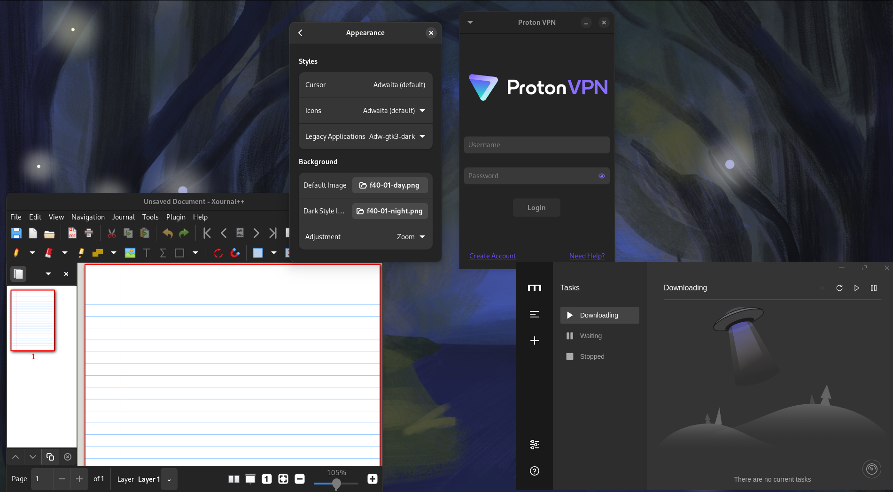
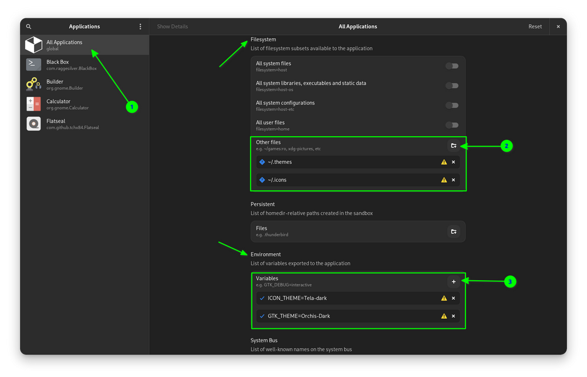

Flatpak is the most popular universal distribution format on Linux, but I still have issues with dark mode detection in certain applications.

However, I have found some workarounds to fix this.

## Make sure dark mode themes are installed for flatpak updates
Technically, flatpak should automatically detect the theme you're using and install it, but if for some reason it doesn't, you can manually install the gtk3 themes you need.

Adwaita:
```bash
flatpak install org.gtk.Gtk3theme.Adwaita-dark/x86_64/3.22
```

Generally for Ubuntu:
dark
```bash
flatpak install flathub org.gtk.Gtk3theme.Yaru-dark
```
light
```bash
flatpak install flathub org.gtk.Gtk3theme.Yaru-light
```

But these are the general themes, if you've changed the accent colour then you're using a different theme, like Yaru-Red-dark for the red accent theme.

You can find all the available gtk3themes on Flathub using the command
```bash
flatpak search gtk3theme
```

## Switch to the stock Adwaita theme


Open the Gnome Tweaks application and make sure you are using the stock Adwaita theme for Gnome.
The default Adwaita theme provides the best compatibility, Some applications like Proton VPN seem to only follow dark mode when using Adwaita.

## Manual overrides

Some applications don't implement the necessary XDG standards to detect dark mode, at least not completely.
These fixes will manually override the default theme, which means that dynamic switching between dark and light themes from GNOME's quick settings won't work anymore when using these overrides.

## Use adw-gtk3

Adw-gtk3 is a gtk3 theme that makes applications look like gtk4.
It's also the theme that fixes all the problems for me.
Apps like Xournal++ won't follow the dark mode with Adwaita, even when I manually select adwaita-dark in gnome-tweaks, but with adw-gtk3-dark it works fine.

Even applications like Motrix, which use an old version of electron that doesn't support automatic dark mode detection, detected dark mode when using adw-gtk3-dark.

[Adw-gtk3 Installaion instructions](https://github.com/lassekongo83/adw-gtk3?tab=readme-ov-file#how-to-install)


## Manual override with Flatseal
If nothing works, you can manually override the theme used by the applications using the `GTK_THEME` environment variable.



You can also do this at the application level.


These are the workarounds I found, for me adw-gtk3 fixed everything and I don't have to worry about this anymore, however, because it is explicitly selected in gnome-tweaks, **the light/dark switch in the quick settings will not work.**.


## Sources
https://ubuntuhandbook.org/index.php/2021/10/enable-dark-flatpak-apps-ubuntu-linux-mint/
https://itsfoss.com/flatpak-app-apply-theme/
https://github.com/lassekongo83/adw-gtk3
