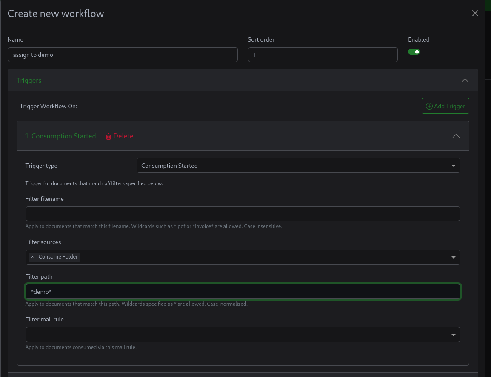
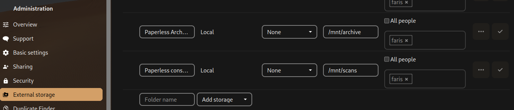

لتحويل مستنداتك الى ملفات رقمية تحتاج فقط لماسح ضوئي (Scanner), لكن مع الوقت تكتشف ان ادارة هذه الملفات, و الوصول للملف الصحيح بسرعة اصعب مما يتوقع.

لذلك توجد انظمه ادارة المستندات (Document managment System), اشهرها في عالم البرمجيات المفتوحة هو Paperless-NGX, وفي هذا المقال سوف اشرح تثبيته مع ذكاء اصطناعي و تضمينه مع Nextcloud.

## Docker-compose

مشروع Paperless-ngx يقدم قوالب docker-compose جاهزه, استخدمها وسوف اذكر التعديلات اللازمة بالخطوات القادمة.

https://github.com/paperless-ngx/paperless-ngx/tree/main/docker/compose

## تجهيز مجلد منفصل لكل مستخدم
لفصل الملفات بحسب المستخدمين, نحتاج ان نغير نمط ترتيب الملفات المستخدم في Paperless-NGX.

هذا ممكن عبر تغيير الاعدادات, ثم انشاء Workflow يحدد ملكية المستند بنائا على اسم مجلد الاستيراد.

### تغيير نمط ترتيب الملفات في Paperless-NGX
باستخدام قائمة المتغيرات المذكورة في  [توثيق Paperless](https://docs.paperless-ngx.com/advanced_usage/#filename-format-variables) يمكن تغيير ترتيب الملفات ليجعل كل ملف يوضع داخل مجلد مخصص للمستخدم المالك للملف.

```diff
services:
  app:
      ....
      environment:
        .....
+        PAPERLESS_FILENAME_FORMAT='{{ owner_username }}/{{ title }}'
```
الان سيحفظ Paperless-NGX الملفات في مجلد مخصص للمستخدم, مع الإبقاء على اسم الملف الاصلي.

### تحديد ملكية الملف بنائا على مجلد الاستيراد

تحتاج ان تنشئ مستخدم اداري لتدخل الى Paperless:
```
docker compose run --rm webserver createsuperuser
```


الاعدادات الافتراضية تجعل الملفات المستورده عبر مجلد الاستيراد "Consumption Folder" موجود للجميع.
لكن يمكن ان ننشئ Workflow يقوم بتحديد ملكية الملف بنائا على موقع الملف المستورد, ووجوده في اي مجلد.

#### Workflow trigger


Trigger type: Consumption started

Filter Sources: Consumption folder

Filter path: `/usr/src/paperless/consume/$USERNAME`

هذا يجعل الاجراء يطبق على اي ملف تم استيرادة من هذا المجلد

يمكنك ايضا استخدام wildcard, للمطابقة مع اي ملف مستورد من مجلد يحتوي على اسم المستخدم في موقعه (Directory Path).
```
Filter path: *$USERNAME*
```

#### Workflow action


الاجراء هو تحديد ملكية الملف للمستخدم, مثلا اذا كان موقع الملف يحتوي كلمة demo, اذا الملف يتبع للمستخدم Demo.

هذا مهم, خاصة للتضمين مع Nextcloud لاحقا.
اذا كانت الطابعة/الماسح الضوئي لديك يدعم استخدام smb لتخزين الملفات, بامكانك تجعلها ترسل المستندات مباشرة الى مجلد الاستيراد الخاص بالمستخدم.
شرحت كيف تقوم بعمل Samba Share مع حاوية Docker هنا:

https://fariszr.com/ar/docker-smb-network-discovery/

## إضافة ذكاء إصطناعي ل Paperless

طبعا في 2025 ممنوع ان تستخدم اي شيء جديد دون ذكاء إصطناعي :)

لكن استخدامه في Paperless-NGX فعلا مفيد, فبرمجيات إستخراج النصوص من الصور (OCR) للاسف ادائها سيء, خاصة في النصوص العربية.

لذلك يمكن استخدام ذكاء إصطناعي بصري (Vision LLM), لإستخراج النصوص وحتى ربما بنية الاوراق.

### تثبيت Paperless-GPT
تفاصيل طريقة التثبيت موجوده على صفحة المشروع على GitHub:

https://github.com/icereed/paperless-gpt?tab=readme-ov-file#installation

اذا كنت تريد إستخدام ollama لتشغيل النماذج, تاكد من تغيير متغييرات `LLM_PROVIDER` و `LLM_MODEL` لollama واسم النموذج المستخدم.
إيضا إحذف متغير `OPENAI_API_KEY`.

بالنسبه ل `PAPERLESS_API_TOKEN`, تستطيع انشاء token من لوحة إدارة django, هناك زر في صفحة الاعدادات تحت اسم المستخدم.

(يمكن إستخدام vLLM بدل Ollama لتشغيل النماذج, لكن ستحتاج لتغيير ال`LLM_PROVIDER` الى OpenAI وثم تحدد رابط VLLM عبر متغير `OPENAI_BASE_URL`)

(يمكنك استخدام مقدمين اخرين, يقدمون دقه افضل لكن هذا يعني ارسال مستنداتك لمقدم طرف ثالث.)

ايضا يمكن تغيير اسماء الوسوم المستخدمه لتحديد الملفات التي سيتم معالجاتها من paperless-gpt, سواء لتحديد البيانات الوصفية او لعمل OCR كامل.

برمجية Paperless-GPT لديها واجهه ويب على منفذ 8080, فكر بوضع reverse proxy امامها, مثال لCaddy:
```caddyfile
paperless-ai.yourdomain.test {
  reverse_proxy paperless-gpt:8080
}
```

### Ollama setup

Ollama هو اسهل طريقة لتشغيل نماذج اللغة محليا, لكن المشكلة ان دعمة لنماذج لغوية مع قدرات بصرية **محدود جدا**, اقوى نموذج بصري متوفر عليه هو `minicpm-v`, وللاسف يقدم اداء سيء بالمحتوى العربي.
نماذج افضل مثل Qwen2.5-VL-7B-Instruct غير مدعومة, البديل هو **vLLM**. (المشكلة ان تشغيله على كروت AMD العادية [*غير 7900xt/x*] معقد)

#### ROCm (AMD)
```yaml
services:
  ollama:
    image: ollama/ollama:rocm
    devices:
      - /dev/kfd:/dev/kfd
      - /dev/dri:/dev/dri
    # environment:
    #   - HSA_OVERRIDE_GFX_VERSION=10.3.0 # for unsupported gpus such as the 6700xt, 7800xt etc.
    volumes:
      - ./ollama:/root/.ollama
    ports:
      - "11434:11434"
```

#### CUDA (Nvidia)
(اذا لديك كرت Nvidia, لا تضيع وقتك, نزل vLLM واستخدم نماذج افضل.)
ستحتاج لتثبيت ال nvidia container toolkit وتشغيلها على دوكر, كامل التفاصيل [على صفحة Docker hub لOllama](https://hub.docker.com/r/ollama/ollama).

```yaml
services:
  container_name: ollama
  ollama:
    deploy:
      resources:
        reservations:
          devices:
            - driver: nvidia
              count: all
              capabilities:
                - gpu
    volumes:
      - ollama:/root/.ollama
    ports:
      - 11434:11434
    image: ollama/ollama
```

#### تنزيل النموذج

```bash
docker exec -it ollama bash
~# ollama pull minicpm-v
```

### إختبار إستخراج النصوص واضافة وسوم مناسبة بإستخدام نموذج لغوي
إفتح واجهه Paperless-gpt (منفذ 8080 بشكل افتراضي) وتاكد ان البرمجية تعمل.
لاإختبار إستخراج النصوص, إذهب الى تبويبه الOCR وادخل معرف (ID) المستند.

معرف المستند (Document ID) موجود في رابط كل مستند, 
`https://paperless.yourdomain.test/documents/XXX/details`

XXX هو المعرف.


لإختبار اقتراحات الذكاء الاصطناعي للمعلومات الوصفية (بنائا على النص المستخرج عبر Tesseract), ستحتاج لإضافة احد وسوم Paperless-GPT للمستند, إفتراضيا إما `paperless-gpt` للمعالجة اليدويه(يحب ان توافق على التعديلات في الواجهه) أو `paperless-gpt-auto` ليطبق التعديلات تلقائيا (لإستخراج النصوص مع الذكاء الاصطناعي الوسم هو `paperless-gpt-ocr-auto`).
يمكن تغيير اسم الوسوم في عبر متغييرات البيئة في ملف docker-compose.yml.

المستندات مع وسم `paperless-gpt`, ستظهر في الواجهه


وبامكانك استخدام الذكاء الاصطناعي لتحسين المعلومات الوصفية بنائا على النص المستخرج بالطريقة التقليديه عبر Tesseract (من Paperless-NGX)


### معالجه جميع المستندات بستخدام Paperless-GPT
أذا كنت تريد معالجه جميع المستندات بستخدام الذكاء الاصطناعي, ستحتاج لانشاء Workflow لإضافة وسوم `paperless-gpt-auto` و `paperless-gpt-ocr-auto` للمستندات الجديدة.
ثم سيتم معالجتهم تلقائيا.


## نصائح عامة لإستخدام Paperless-NGX 

وجدت النصائح هنا عن طريقة استخدام Paperless-NGX مفيدة:

https://reddit.com/r/selfhosted/comments/sdv0rr/paperless_ng_which_tags_document_types/

ايضا تاكد من ان تضيف العربية كلغة للocr
تحت قسم التهيئة ثم اعدادات OCR, ثم اللغة اكتب:
eng+ara

والان اصبح لديك نظام ادارة مستندات مع ذكاء إصطناعي!

## التضمين مع Nextcloud

على الاغلب اذا قمت بتثبيت Paperless, فانت لديك ايضا نظام تخزين سحابي, وأشهرهم هو Nextcloud.

بمكن تضمين Paperless مع Nextcloud عبر استخدام External mounts في Nextcloud, حتى يظهر مجلد لاستيراد الملفات, ومجلد للملفات المؤرشفة لكل مستخدم.



`/mnt/archive` هو مجلد مربوط (Mounted Directory) بمجلد الارشيف المخصص للمستخدم من Paperless:

```
{YOUR_DOCKER_DIR}/paperless-ngx/media/documents/archive/$USER:/mnt/archive:ro
``` 

ومجلد Scans مربوط بمجلد mounted ك`/usr/src/paperless/consume/$USER` في حاوية paperless.

تاكد من استخدام مجلدات مخصصه لكل مستخدم هو الاعداد الافتراضي, وان هناك Workflows لاضافة الملكية الصحيحة بنائا على موقع الملف المستورد.

## المصادر
https://www.madebyagents.com/blog/paperless-ngx-nextcloud-integration

https://github.com/icereed/paperless-gpt