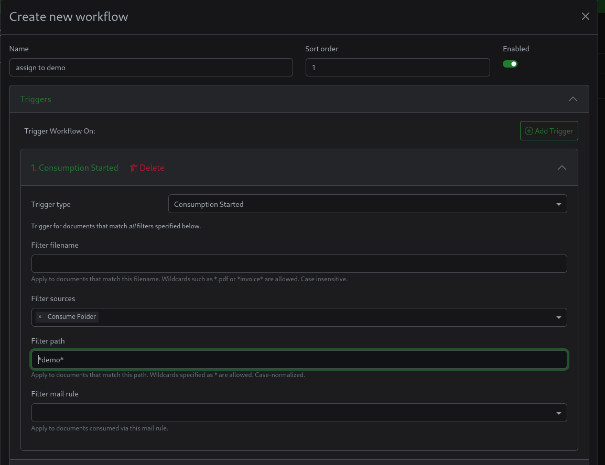
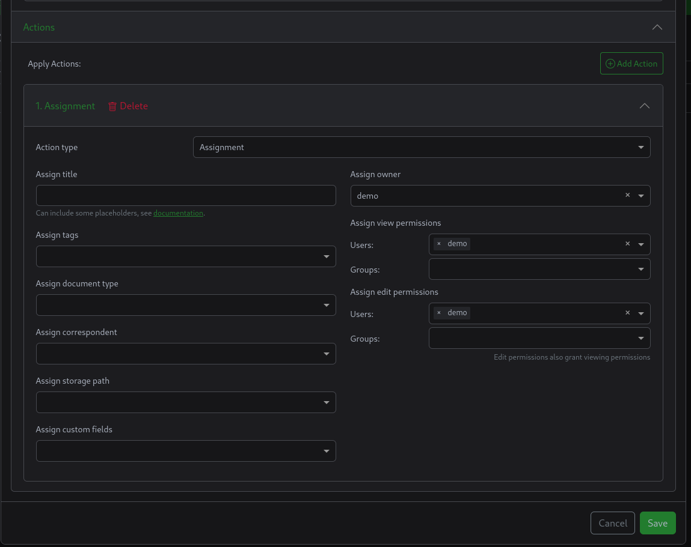
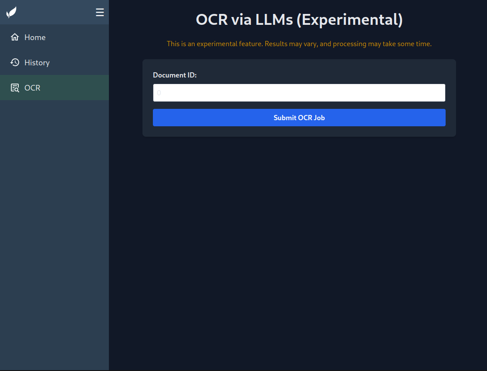
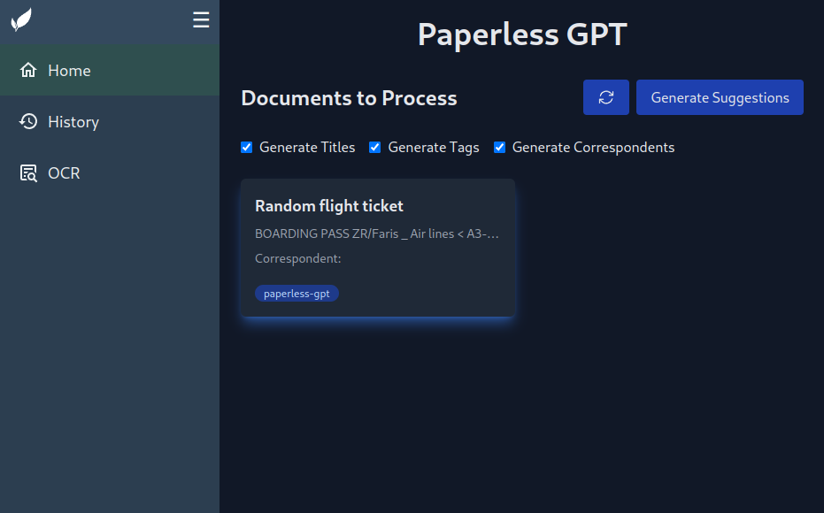
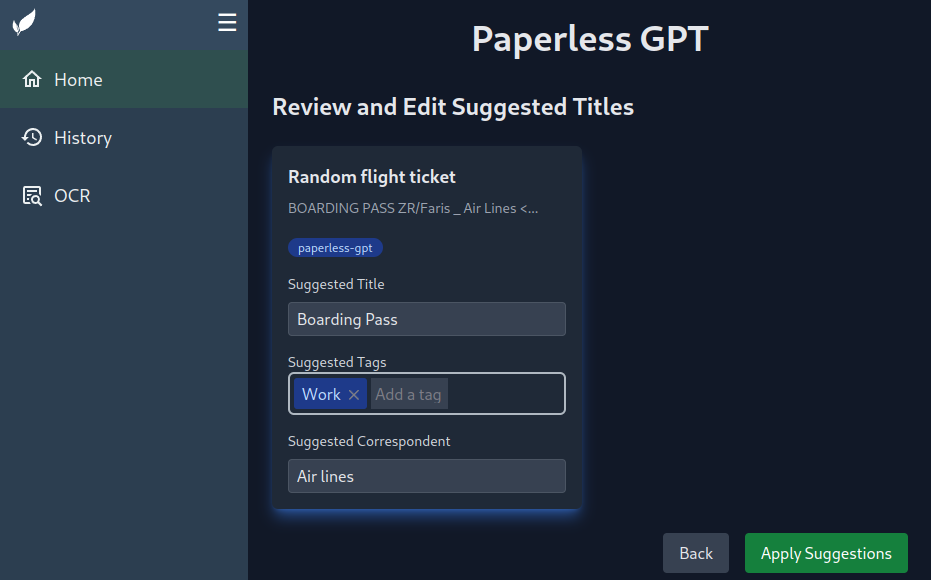
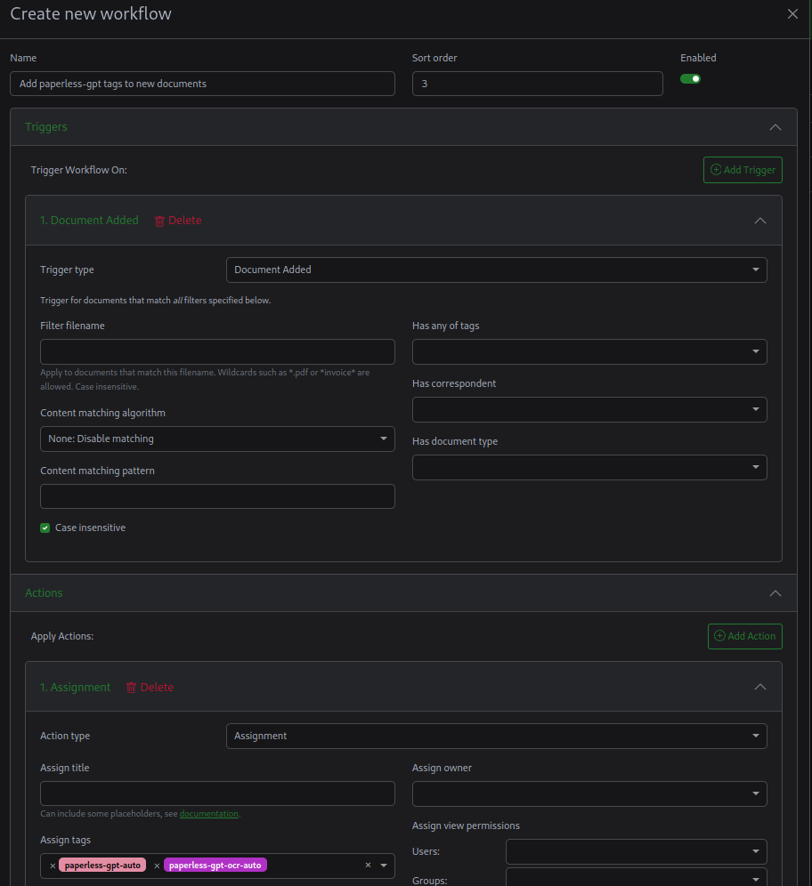
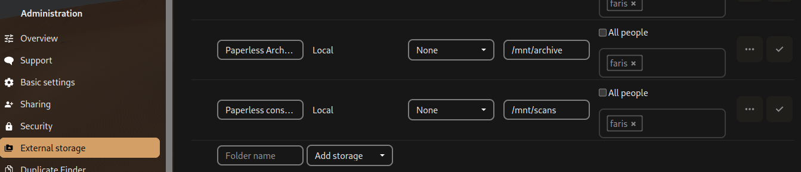

Having a scanner is the first step of going paperless, however with time you realize that keeping stuff in order and finding documents quickly becomes a challenge, even when using full text search in the cloud.

Thats why document management Systems like Paperless-ngx exist.
And in this post I'm going to setup paperless-ngx with Nextcloud Integration, automated AI tagging and more accurate LLM-powered OCR.

## Docker-compose

For the docker compose setup i don't have to explain much, Paperless-ngx has template docker files ready to use in their Git repos and a quick guide on how to use them:
https://docs.paperless-ngx.com/setup/#docker

The needed changes will be mentioned in the next steps.

## setting up separate directories for each user
unless you want every user to be able to see each others documents, you need to make sure paperless separates the resulting files into a per-user dir.

You can do this with workflows and storage Paths, or make it the default and just use workflows to assign documents to users when importing("consuming") docs.

### Make Paperless-ngx use a separate directory for each user.
Using the placeholder details in the Paperless [docs](https://docs.paperless-ngx.com/advanced_usage/#filename-format-variables), you can set the default file format in Paperless using an environment variable.

```diff
services:
  app:
      ....
      environment:
        .....
+        PAPERLESS_FILENAME_FORMAT='{{ owner_username }}/{{ title }}'
```
This will keep the filename and store the file in an owner-specific directory in the paperless archive folder

### Assign ownership based on subdirectory in consumption directory

By default, when importing from the consumption directory, the file is available to all users, but with workflows we can tell Paperless to assign ownership based on the file dir when importing.

If you have a scanner/printer that supports Samba, you can have it scan directly to a user-specified SMB share.
A guide to setting up an SMB share with Docker can be found [here](https://fariszr.com/docker-smb-network-discovery/).

#### Workflow trigger


Trigger type: Consumption started
Filter Sources: Consumption folder

Filter path: `/usr/src/paperless/consume/$USERNAME`
This matches any file imported from a specific directory

you can also use wildcards to match any file with the username in its directory by just writing `*$USERNAME*`

#### Workflow action


the action should be to assign the ownership and rights to the user.

## AI with Paperless-GPT
It's 2025, we need to have AI in everything right?

It makes sense here though, with Paperless-GPT you can use it to OCR documents using vision LLM models, using cloud vision models like GPT-4o, custom services from Google and Azure or even using local open source LLMs!

### Install paperless-GPT
https://github.com/icereed/paperless-gpt?tab=readme-ov-file#installation

Assuming you want to use ollama, make sure you adjust the `LLM_PROVIDER` and `LLM_MODEL` variables accordingly.
Also comment out the `OPENAI_API_KEY` environment variable.

For `PAPERLESS_API_TOKEN`, you can generate a token by going to the django admin dashboard, which you can find in the settings page under your profile icon in the top right.

(You can also use vLLM, in which case you should probably stick with openai as your provider, while setting the `OPENAI_BASE_URL` to point to vLLM).

You can also customize the tags used to trigger processing by paperless-gpt, whether just for metadata or for OCR.

Paperless-gpt has a webui exposed on port 8080 by default, consider setting up a reverse proxy in front of it.
Example for caddy:
```caddyfile
paperless-ai.yourdomain.test {
  reverse_proxy paperless-gpt:8080
}
```

### Ollama setup

Ollama is the easiest way to run LLMs locally, but its support for Vision LLMs is **very limited**, with the latest model being `minicpm-v` 2.6, which doesn't work well with non-Latin languages.
If you want to run better models like Qwen2.5-VL-7B-Instruct, you will have to use **vLLM** for that. (if you figure out how to make it run on consumer AMD GPUs [*not the 7900xt/x*], hit me up)

#### ROCm (AMD)
```yaml
services:
  ollama:
    image: ollama/ollama:rocm
    devices:
      - /dev/kfd:/dev/kfd
      - /dev/dri:/dev/dri
    # environment:
    #   - HSA_OVERRIDE_GFX_VERSION=10.3.0 # for unsupported gpus such as the 6700xt, 7800xt etc.
    volumes:
      - ./ollama:/root/.ollama
    ports:
      - "11434:11434"
```

#### CUDA (Nvidia)
(If you have an Nvidia GPU, You should probably be using vLLM for this)
You will need to install the nvidia container toolkit and enable it for docker, see the [Ollama's docker hub page](https://hub.docker.com/r/ollama/ollama) for details.

```yaml
services:
  container_name: ollama
  ollama:
    deploy:
      resources:
        reservations:
          devices:
            - driver: nvidia
              count: all
              capabilities:
                - gpu
    volumes:
      - ollama:/root/.ollama
    ports:
      - 11434:11434
    image: ollama/ollama
```

#### pulling the llm model

```bash
docker exec -it ollama bash
~# ollama pull minicpm-v
```

### Testing out OCR and Tag suggestions using minicpm-v
Open the paperless-gpt dashboard (exposed on port 8080 by default) and check that everything is working correctly.

To test OCR with a Vision LLM, go to the OCR tab and enter the ID of a document you want to test on.


You can find the ID in the URL of each document, `https://paperless.yourdomain.test/documents/XXX/details`, XXX being the document id.




To test the metadata suggestions (based on the text extracted by teserract), you have to add one of the paperless-gpt processing tags to the document, by default `paperless-gpt` for manual processing (you have to trigger it in the UI) and `paperless-gpt-auto` for automatic processing (for OCR its `paperless-gpt-ocr-auto` by default).
You can customize the tag names using environment variables in docker compose.

When documents are tagged with `paperless-gpt`, they are displayed in the web interface.


You can now create better metadata based on the OCR text (from Paperless-NGX).




### Process all documents with Paperless-gpt
If you want all documents to be processed by AI, you can create a workflow to add the `paperless-gpt-auto' and `paperless-gpt-ocr-auto' tags to new documents.
They will then be automatically processed by paperless-gpt and updated accordingly.



## General Tips on using Paperless

I found this thread on reddit to be useful on how to get started with Paperless:

https://reddit.com/r/selfhosted/comments/sdv0rr/paperless_ng_which_tags_document_types/


And now you have an (AI-assisted) Document management System!

## Nextcloud Integration

Now if you are setting up paperless, chances are, you are using a cloud solution like nextcloud.

You can integrate Nextcloud with Paperless through external mounts, you can mount the user-specfic consumption directory for each user, and then the archive directory to be able to access processed pdfs.



/mnt/archive being a mounted directory pointing to the `{YOUR_DOCKER_DIR}/paperless-ngx/media/documents/archive/$USER$:/mnt/archive:ro` and scans pointing to a directory mounted as `/usr/src/paperless/consume/$USER` in paperless.

Make sure to set per-user paths as the default or to create an active workflow to assign storage paths depending on the import-path.

## Sources
https://www.madebyagents.com/blog/paperless-ngx-nextcloud-integration

https://github.com/icereed/paperless-gpt