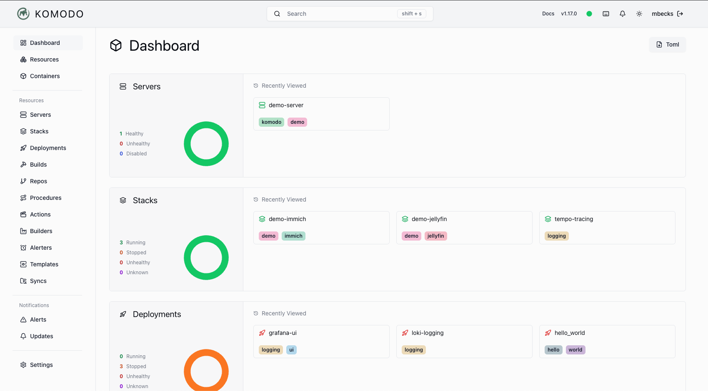
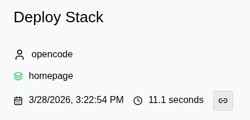
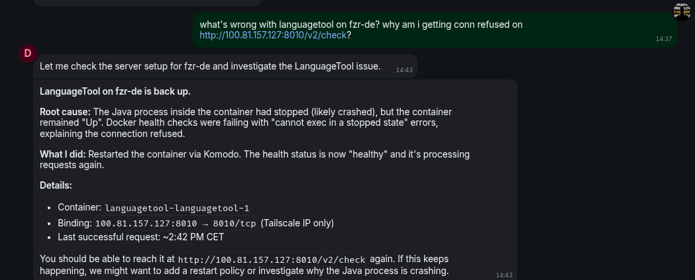
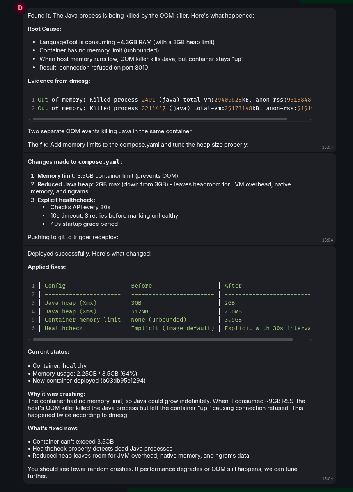

The most annoying thing about homelabbing is the upkeep. Keeping things running, handling breaking updates, fixing stuff as it breaks instead of letting everything slowly decay.
It's kinda embarrassing telling people how cool your Homelab is, only for things to break constantly.

Luckily AI agents have gotten good enough that you can use them for the upkeep of your homelab.

Until now though, you still had to sit down at your computer, start an agent, copy the logs, show it the error, and unless it's running on the server itself, apply the fix manually.

You could install the agent directly on the server and let it manage things, but what if you have multiple servers? Like a whole homelab network?

Do you install an agent on every server? And what happens when services depend on each other?

## Komodo

Here comes [Komodo](https://komo.do/).
Komodo is an open-source GitOps platform that lets you manage your Docker Compose stacks through a clean UI with full API access to logs, container status, and even a bash shell on the server.

It's a central hub for all your servers.
What makes it special is that any change you make to your stacks, resources, or Procedures in Komodo can be committed back to git, so things never drift from the repo.
Everything around your compose stacks is described as code under the Resources folder: servers, procedures.
That means your agent can also adjust how Komodo itself works on the fly.

### My secret sauce: The Komodo KM CLI, agentic edition.

Komodo has a powerful API, but the official CLI doesn't expose all of it.
So I built my own version, [the "agentic" edition](https://github.com/FarisZR/komodo-agentic-cli/tree/agentic-cli/bin/cli).
It adds support for:

- `stack` - manage stacks and see their status
- `procedure` - trigger procedures like auto-updates
- `sync` - manage resource sync (GitOps repos)
- `variable` - manage variables and secrets without exposing values to the agent (e.g. setting secrets as command outputs)

It also adjusts the `exec` and `ssh` commands so agents can run commands on the host or inside a container non-interactively. (`ssh` for interactive sessions, `exec` for non-interactive commands.)

Running the KM CLI within a GitOps repo lets your agent debug running homelab services, fix issues, plan and push updates, or even tackle that migration we've all been putting off for months.

You can also create a service user so you have an idea what the agent did on komodo.

And if you don't want your agent running arbitrary commands on your servers, you can disable that at the container or server level in the Komodo "periphery" config. Just install periphery and edit the config to disable terminal access for the host or all containers.

## AI Assistants (OpenClaw or Hermes Agent)

Komodo solves the stack access and management problem, but you still have to sit down, open your computer, and prompt the agent to fix things.

What if you could just message your agent and say "Jellyfin is down, fix it"?
That's the idea behind async personal assistants like OpenClaw and the newer Hermes. Fix things as you notice them, wherever you are.

Just clone the git repo, install the agentic KM CLI skill, and your agent can debug and fix any issue across your homelab, even a multi-server network.

Homelabbing becomes genuinely fun. You say what you want and it appears. You can see what changed, revert it easily thanks to git, and even set up backups to guard against catastrophic failures, though most models are smart enough to not do the classic `rm -rf` mistake anymore. Still nice to have.

### Openclaw in action

So how does this look in reality? What can I use this for? Well, I quickly found a use for this.

I self-host my own language tool server and it breaks often. So why not let OpenClaw figure out a solution for it?

After telling it to investigate and actually solve the issue, it deployed a new modified docker stack that added a memory limit to the container

I legit did this while i was cooking in the kitchen, didn't need to do anything manually.

## The next step: full automation.

Deploying new services and fixing containers on demand is great. But what if things never broke in the first place? What if your agent fixed issues as they happened, not as you noticed them?
AKA what if things just Self healed?

it's actually doable now. All you need is Komodo's alert system calling a webhook connected to your OpenClaw or Hermes agent. The agent sees the logs and makes whatever changes are needed to bring the service back up. If it's a server-level issue, you could even hook into your hoster's API and trigger a force restart.
It doesn't even have to be fully autonomous. You could build a way for the agent to reach you and ask you for approval.

It's proactive. The agent already has the fix and you are the one to allow it or not. You are actually the manager now.

Honestly, thinking about it feels a bit wild. We're on our way to self-healing, self-aware systems that can change themselves to stay up no matter what. Give your agent enough access and resources, and it could restore a backup on another server and bring the service back up without you ever noticing. This is an exciting time for sure.
