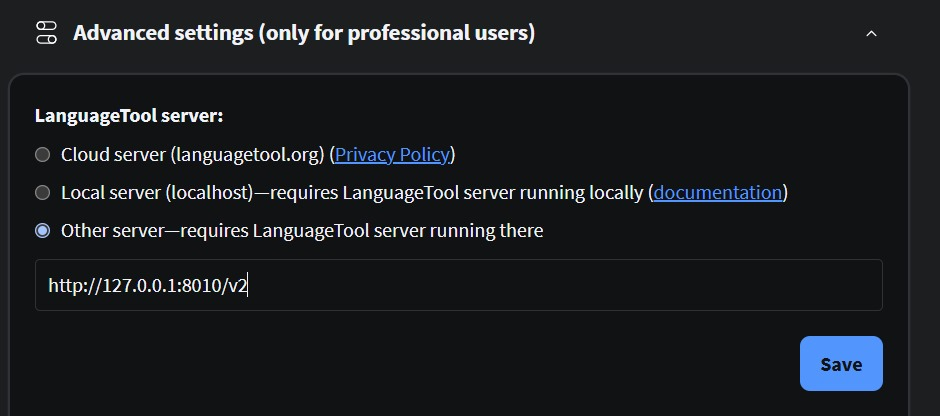

Self-hosted grammar autocorrect with LanguageTool and Docker Compose.

LanguageTool is a great extension for correcting typos and grammar errors, it's basically a more advanced and useful version of autocorrect.

However, LanguageTool watches everything you type in real time, so it's a real privacy risk.

Fortunately, LanguageTool is open source, at least the core of it, and you can easily host it yourself using Docker.

## Setup
### Download the N-gram language weights

Ngrams are large datasets that help Languagetool improve context-dependent corrections, such as yours and there.

Languagetool offers free n-gram datasets for a few languages, but AFAIK they are not the same as those used in the cloud version, and certainly not in the premium version.

https://languagetool.org/download/ngram-data/

Download and extract the N-gram datasets into a language-specific folder under the N-grams directory, etc. `./ngrams/en, ./ngrams/de`.

### Docker-compose.yml

```yaml
services:
  languagetool:
    image: erikvl87/languagetool:latest
    tmpfs:
      - /tmp:exec
    cap_drop:
      - ALL
    cap_add:
      - CAP_SETUID
      - CAP_SETGID
      - CAP_CHOWN
    security_opt:
      - no-new-privileges
    ports:
      - 100.81.157.127:8010:8010
    environment:
      - langtool_languageModel=/ngrams   # OPTIONAL: Using ngrams data
      - Java_Xms=512m                    # OPTIONAL: Setting a minimal Java heap size of 512 mib
      - Java_Xmx=2g # Max memory 
    volumes:
      - ./ngrams:/ngrams
```

## Add Fasttext
Contrary to its name, Fasttext is not about improving correction speed, it's an algorithm to improve autocorrect accuracy using an open model from Facebook.

### Dockerfile
```dockerfile
FROM erikvl87/languagetool:latest
USER root
RUN apk add fasttext
USER languagetool
```

### download the fasttext Model
fasttext also needs a model to work:
https://fasttext.cc/docs/en/language-identification.html

Save it in the same LanguageTool directory and rename it to fasttext-model.bin.

### Fully featured Docker-compose
```yaml
services:
  languagetool:
    # image: erikvl87/languagetool:latest
    build: .
    container_name: languagetool
    restart: always
    tmpfs:
      - /tmp:exec
    cap_drop:
      - ALL
    cap_add:
      - CAP_SETUID
      - CAP_SETGID
      - CAP_CHOWN
    security_opt:
      - no-new-privileges
    ports:
      - 8010:8010
    environment:
      - langtool_languageModel=/ngrams   # OPTIONAL: Using ngrams data
      - Java_Xms=512m                    # OPTIONAL: Setting a minimal Java heap size of 512 mib
      - Java_Xmx=3g
      - langtool_fasttextBinary=/usr/bin/fasttext
      - langtool_fasttextModel=/fasttext-model.bin
    volumes:
      - ./ngrams:/ngrams
      - ./fasttext-model.bin:/fasttext-model.bin
```

## Make the web extensions use your selfhosted instance
Go to languagetool settings, scroll all the way down to pro settings, and then enter the URL of your instance with `/v2` appended at the end. If you are hosting it on the same machine, then it is https://127.0.0.1:8010/v2.



BTW you can use languagetool in other applications like [Vscode/Vscodium](https://github.com/ltex-plus/vscode-ltex-plus) and Libreoffice.

## Sources
https://github.com/Erikvl87/docker-languagetool/issues/70
https://github.com/Erikvl87/docker-languagetool
