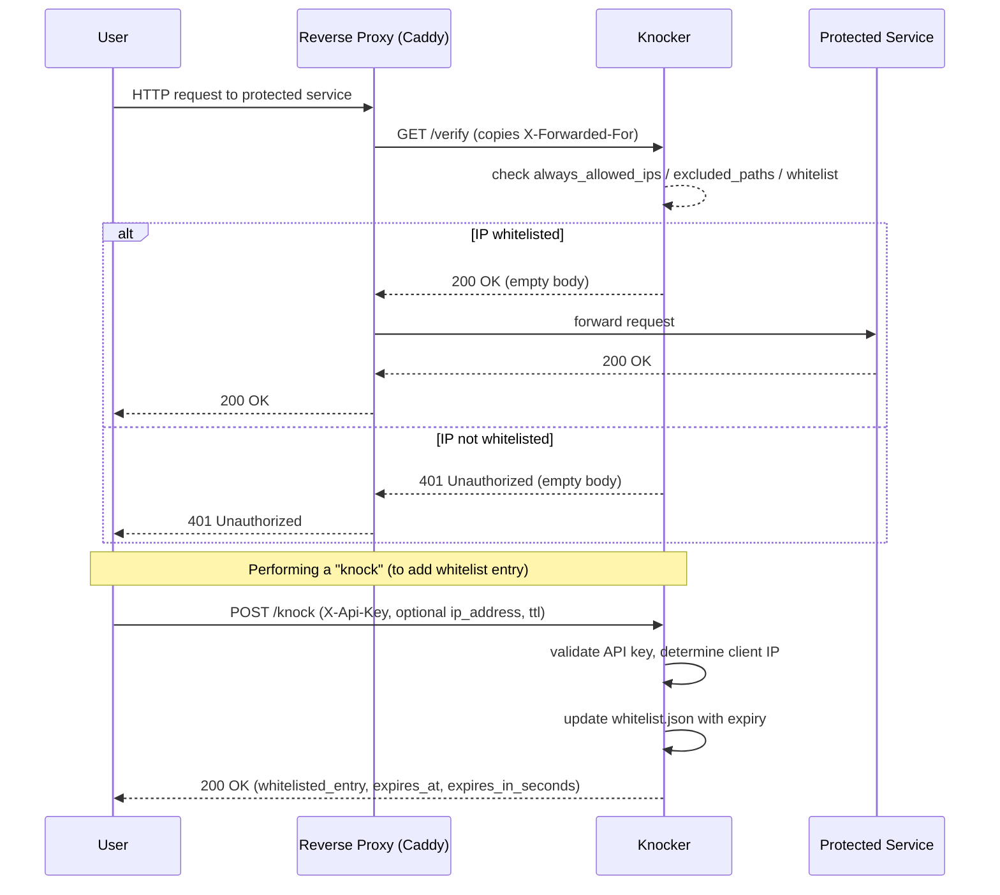

I have a homelab, but it's very annoying to access it outside my home network, so i created Knocker!
A knock based access control service for your homelab, that doesn't break the mobile Apps!

Knocker's strong point is its clients, i built a PWA web app, a go CLI and an Android app, so you are covered on all major platforms.

## How does it work?

### But Tailscale Already exists!

I already use Tailscale, in fact the IP of my homelab is the tailscale ip because i already added custom routes for the tailscale IPs.

But using a vpn is annoying, it has to be installed on each device, which is a hassle on a smart TV for example and the Tailscale app on android kills the battery life.

With knocker you just need one device to allow the entire network (thanks to NAT).

### Is this as secure as a VPN?

NO.
Knocker is a compromise, it's more convenient than a VPN (IMO), but because of this convenience it's also not as secure, as you can't whitelist devices, rather only Source IPs, and IPs that could be CGNAT IPs.

You are basically making a bet that in that whitelist period, the likelyhood of a hacker finding out about your service and trying to hack it is quite slim.

That's why you also should use short TTLs in public networks
But In general you should put knocker in front of services that have their own auth.

## Setup

Knocker is 