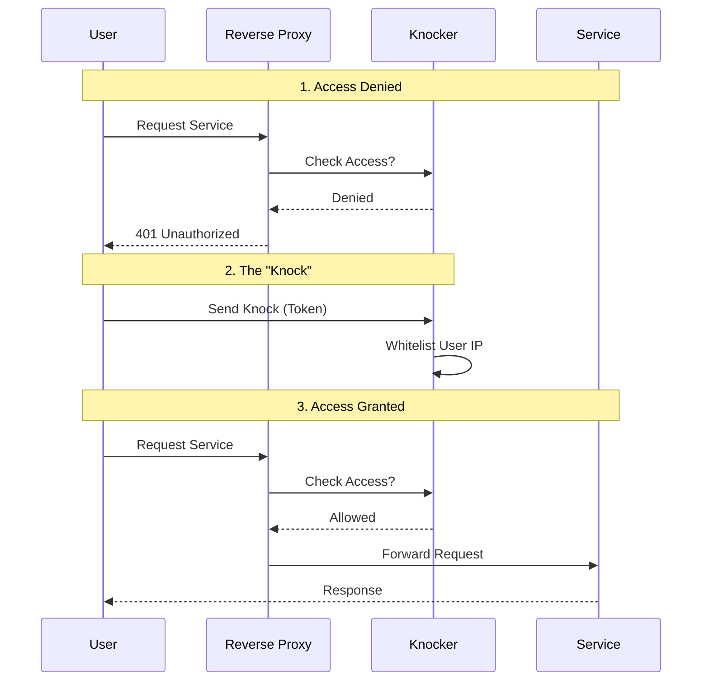
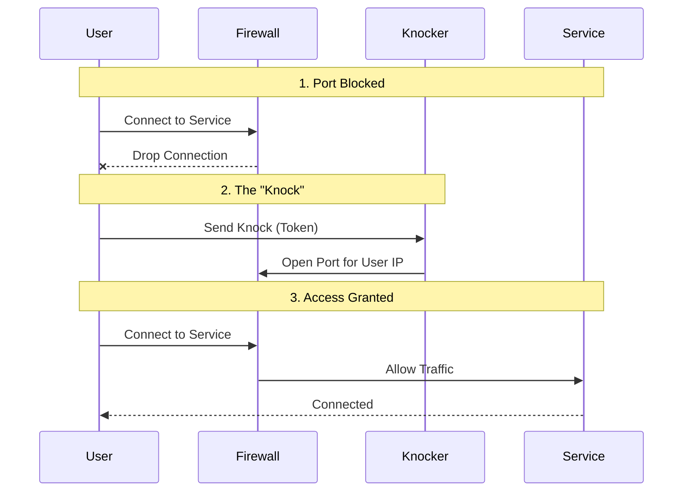
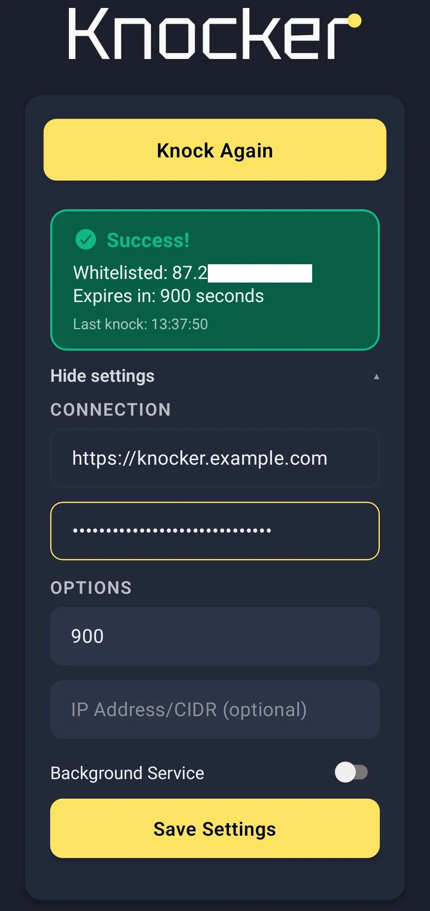

I have a homelab, but it's very annoying to access it outside my home network, so i created Knocker!
A knock based access control service for your homelab, that doesn't break mobile Apps!
With clients that cover most major platforms, web, android, and desktop!

<!-- markdownlint-disable MD033 -->

<!-- markdownlint-enable MD033 -->

## How does it work?



By being completely transparent for whitelisted IPs, knocker doesn't break any api client like mobile apps.
Whitelist your ip and you are ready.
You can even whitelist another ip other than your own if you want.


### Knocker tokens

Knocker works by using tokens as passwords.
Each token has specific permissions like a customizable max TTL (will be capped server side), and an option to allow whitelisting IPs other than your own.

By connecting knocker to your reverse proxy, knocker will get the request ip and depending on the local whitelists will either give a 200 or a 401 that will be forwarded to the end client.


## But Tailscale Already Exists?

I already use Tailscale, in fact the IP of my homelab is the tailscale ip because i already added custom routes for the tailscale IPs.

But using a vpn is annoying, it has to be installed on each device, which is a hassle on a smart TV for example and the Tailscale app on android kills the battery life.

With knocker you just need one device to allow the entire network (thanks to NAT).

### Is this as secure as a VPN?

NO.
Knocker is a compromise, it's more convenient than a VPN (IMO), but because of this convenience it's also not as secure, as you can't whitelist devices, rather only Source IPs, and IPs that could be CGNAT IPs.

You are basically making a bet that within that whitelist period, the likelyhood of a hacker finding out about your service and trying to hack it is quite slim.

That's why you also should use short TTLs in public networks
But In general you should put knocker in front of services that are authenticated

## Setup

Knocker is distributed as a docker container, that optionally uses the systen dbus socket to interact with the FirewallD daemon.

docker.compose.yml: https://github.com/FarisZR/knocker/blob/main/docker-compose.yml

### knocker.yaml

```yaml
server:
  host: "0.0.0.0"
  port: 8000
  trusted_proxies:
    # Trust the IPv4 and IPv6 subnets of the caddy_net docker network
    # Adjust these to match your specific Docker network configuration.
    - "172.16.238.0/24"
    - "fd00:dead:beef::/64"

cors:
  allowed_origin: "https://knocker.fariszr.com"  # SECURITY: Set to your Knocker web webapp's origin if you are hosting your own.

security:
  always_allowed_ips:
    # These IPs/CIDRs are always allowed to pass through the /verify endpoint
    # without needing to be dynamically whitelisted.
    # It's recommended to include your reverse proxy's IP here.
    - "172.16.238.0/24"
    - "fd00:dead:beef::/64"
    # Also your homes local network
    - "192.168.1.0/24"
  excluded_paths:
    # Request paths that start with any of these values will bypass
    # the IP whitelist check entirely.
    # Example:
    # - "/api/v1/status"
    # - "/metrics"
    - "/knock"
  # Maximum number of entries in the whitelist (default: 10000)
  max_whitelist_entries: 10000

whitelist:
  # The path where the whitelist file will be stored.
  # This path is relative to the container's file system.
  # The docker-compose.yml file will mount a volume to this location.
  storage_path: "/data/whitelist.json"

api_keys:
  - name: "admin-key-for-remote-whitelisting"
    key: "CHANGE_ME_SUPER_SECRET_ADMIN_KEY"  # SECURITY: Change this to a strong, random key
    max_ttl: 3600  # Maximum TTL in seconds (1 hour)
    allow_remote_whitelist: true  # Can whitelist other IP/CIDR specified in request body
```

### Connecting your reverse proxy to knocker

I use Caddy, but knocker should work with any reverse proxy that supports using an external auth endpoint.

```caddy
# Define a reusable snippet for the knock-knock check.
# It points to the knocker service using Docker's internal DNS.
(knocker_auth) {
  forward_auth knocker:8000 {
    uri /verify?
    copy_headers X-Forwarded-For
  }
}

# The public endpoint for performing the knock.
# Make sure this domain points to your Caddy server's IP.
knock.your-domain.com {
  reverse_proxy knocker:8000
}

# An example protected service.
jellyfin.your-domain.com {
  import knocker_auth  # Apply the forward_auth check
  reverse_proxy jellyfin_service_name:8096
}
```

Now your service will responed with a 401 for every non-whitelisted IP.

## FirewallD integration

Knocker has another trick up its sleeve, it can integrate with firewalld to operate on the firewall level, so that you can use it for non-http services like a game server!



<!-- markdownlint-disable MD033 -->

<!-- markdownlint-enable MD033 -->

there's a caveat though, **exposed Docker Ports will still bypass these rules.**
Unfortunately there's isn't any firewall that actually deals with docker port forwarding rules well.
You have to use host networking mode for it to work.

```yaml
firewalld:
  enabled: true 
  zone_name: "knocker" 
                        # WARNING: Zone won't be cleaned up automatically on shutdown
  zone_priority: -100  # Zone priority (negative numbers = higher priority)
  # zone_target: "default"  # Optional: Set the zone target (default: not set)
                            # Options: "default", "ACCEPT", "REJECT", "DROP"
                            # "default" = practically matches reject behavior
                            # "ACCEPT" = Accept all packets not matched by rules set by knocker
                            # "REJECT" = Reject all packets not matched by rules set by knocker
                            # "DROP" = Silently drop all packets not matched by rules set by knocker
  default_action: "drop"  # Action for blocked traffic on monitored ports:
  monitored_ports:
    # Only these ports will be protected by knocker firewall rules
    - port: 80
      protocol: tcp
    - port: 443
      protocol: tcp
    - port: 22
      protocol: tcp
  monitored_ips:
    # WARNING: Using 0.0.0.0/0 or ::/0 applies DROP/REJECT rules to ALL traffic
    - "203.0.113.0/24"        # Example WAN IPv4 range - CHANGE THIS
    - "2001:db8:1234::/48"    # Example WAN IPv6 range - CHANGE THIS
```

## Clients

The strong point of Knocker, and where i actually spent most of my time was the clients.
i designed the clients to get out of the way as much as possible.·

### Knocker-Web

[GitHub.com/FarisZR/Knocker-Web](https://github.com/FarisZR/Knocker-Web)


Knocker Web is a web client built with Vite.
it's fully static, and can be installed as a PWA, and it's meant to be the leading client, as it basically works everywhere.

What makes it really convenient though is the knock on reload feature.
You just open the site and that's it, you don't care what happens after that.
It's especially useful when used as a PWA, as it means it will do a knock when started.

### Knocker-CLI

[GitHub.com/FarisZR/knocker-CLI](https://github.com/FarisZR/knocker-CLI)

A CCI client written in Go with support for creating a background service for periodic knocks using Systemd/LaunchAgent.

```sh
>> knocker --help
A reliable, cross-platform service that keeps your external IP address whitelisted.
It runs in the background, detects IP changes, and ensures you always have access.

Usage:
  knocker [flags]
  knocker [command]

Available Commands:
  completion  Generate the autocompletion script for the specified shell
  help        Help about any command
  install     Install the Knocker service
  knock       Manually trigger a whitelist request
  run         Run the Knocker service
  start       Start the Knocker service
  status      Get the status of the Knocker service
  stop        Stop the Knocker service
  uninstall   Uninstall the Knocker service

Flags:
      --check_interval int    Interval in minutes to poll for IP changes (only used when ip_check_url is set) (default 5)
      --config string         config file (default is $HOME/.knocker.yaml)
  -h, --help                  help for knocker
      --ip_check_url string   URL of the external IP checker service
      --ttl int               Time to live in seconds for the knock request (0 for server default)
  -v, --version               version for knocker

Use "knocker [command] --help" for more information about a command.
```

#### Knocker-Gnome

[GitHub.com/FarisZR/knocker-Gnome](https://github.com/FarisZR/knocker-Gnome)


An experimental Gnome extension that interprets the JSON logs output by Knocker-CLI, and allows you to manually trigger knocks, disable the service and see the timeout for the current knock.

### Knocker-EXPO

[GitHub.com/FarisZR/knocker-expo](https://github.com/FarisZR/knocker-expo)



An Experimtal Android App built using React EXPO.
it does the same thing as the PWA, with support for creating a background service to regularly create knocks.

However its reliability depends on the manufacture, as not all of them actually allow android background processes to run reliabily.

## vibe coded with Ai

Thanks to the roo code hackathon sponsored by Requestly and Google I could actually implement this idea.
I started the project with gemini 2.5 pro, reached over 1700$ in used tokens for the service and the clients, but the continued using GPT-5-CODEX and github coding agent (Sonnet 4 mostly) as a starter point for new featurss.

I used coderabbit for reviews, and had a full integration test environment for the agents to iterate against, that's why the project even works in the first place.

There are no vulns detected by any static code analysis system I ran over the backend service.

So this is isn't your avg i told replit to code it project, but still if you are anti AI don't use this please.

I may go into more details about my workflow for implementing knocker using roo code in a separate blog post because it wasn't easy to go so far with Ai.
