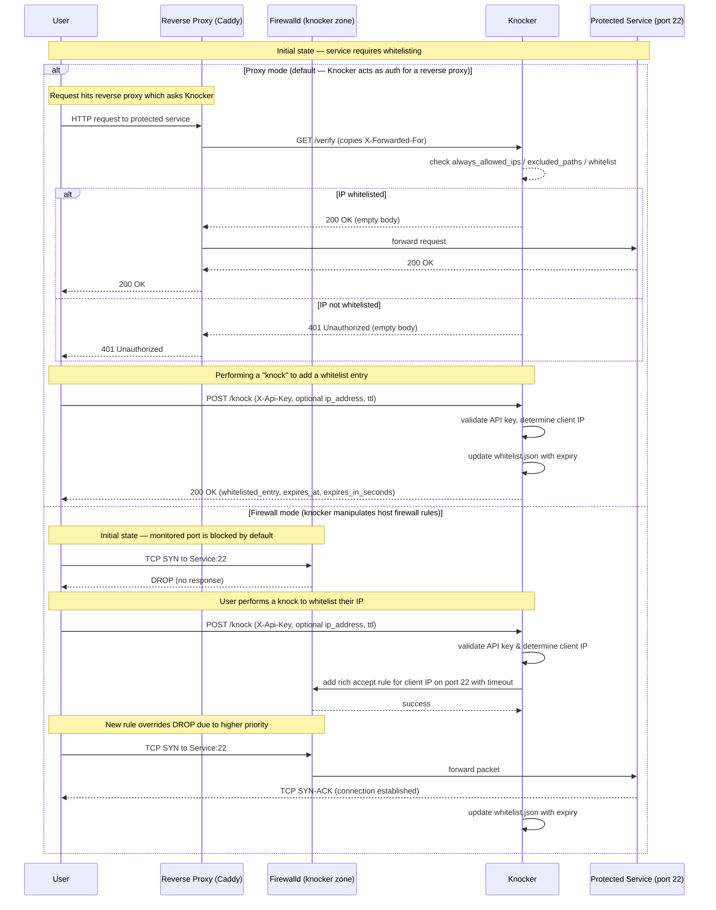

I have a homelab, but it's very annoying to access it outside my home network, so i created Knocker!
A knock based access control service for your homelab, that doesn't break mobile Apps!

Knocker's strong point is its clients, i built a PWA web app, a go CLI and an Android app, so you are covered on all major platforms.

<!-- markdownlint-disable MD033 -->

<!-- markdownlint-enable MD033 -->

## How does it work?



By being completely transparent for whitelisted IPs, knocker doesn't break any api client like mobile apps.
Whitelist your ip and you are ready.
You can even whitelist another ip other than your own if you want.


### Knocker tokens

Knocker works by using tokens as passwords.
Each token has specific permissions like a customizable max TTL (will be capped server side), and an option to allow whitelisting IPs other than your own.

By connecting knocker to your reverse proxy, knocker will get the request ip and depending on the local whitelists will either give a 200 or a 401 that will be forwarded to the end client.


### But Tailscale Already Exists?

I already use Tailscale, in fact the IP of my homelab is the tailscale ip because i already added custom routes for the tailscale IPs.

But using a vpn is annoying, it has to be installed on each device, which is a hassle on a smart TV for example and the Tailscale app on android kills the battery life.

With knocker you just need one device to allow the entire network (thanks to NAT).

### Is this as secure as a VPN?

NO.
Knocker is a compromise, it's more convenient than a VPN (IMO), but because of this convenience it's also not as secure, as you can't whitelist devices, rather only Source IPs, and IPs that could be CGNAT IPs.

You are basically making a bet that in that whitelist period, the likelyhood of a hacker finding out about your service and trying to hack it is quite slim.

That's why you also should use short TTLs in public networks
But In general you should put knocker in front of services that have their own auth.

## Setup

Knocker is distributed as a docker container, that optionally uses the systen dbus socket to interact with the FirewallD daemon.

### Docker Compose

```yaml
services:
  # caddy:
  #   image: caddy:latest
  #   restart: unless-stopped
  #   ports:
  #     - "80:80"
  #     - "443:443"
  #     - "443:443/udp" # For HTTP/3
  #   networks:
  #     - caddy_net
  #   volumes:
  #     - ./Caddyfile:/etc/caddy/Caddyfile
  #     - ./knocker.yaml:/app/knocker.yaml
  #     - caddy_data:/data
  #     - caddy_config:/config
  #   depends_on:
  #     - knocker

  knocker:
    # Use 'latest' for stable releases or 'main' for development builds
    image: oci.fariszr.com/fariszr/knocker:latest
    restart: unless-stopped
    networks:
      - caddy_net
    volumes:
      - ./knocker.yaml:/knocker.yaml
      - ./knocker_data:/data
      # REQUIRED OPTIONS for firewalld integration
      # - /var/run/dbus/system_bus_socket:/var/run/dbus/system_bus_socket
    # user: "0:0"  # Run as root
    # userns_mode: host
    # cap_add:
    #   - NET_ADMIN

networks:
  caddy_net:
    # Enable IPv6 for this network
    enable_ipv6: true
    driver: bridge
    ipam:
      driver: default
      config:
        # Define subnets for both IPv4 and IPv6.
        # Your 'trusted_proxies' in knocker.yaml should include these.
        - subnet: 172.16.238.0/24
        - subnet: fd00:dead:beef::/64
```

### knocker.yaml

```yaml
server:
  host: "0.0.0.0"
  port: 8000
  trusted_proxies:
    # Trust the IPv4 and IPv6 subnets of the caddy_net docker network
    # Adjust these to match your specific Docker network configuration.
    - "172.16.238.0/24"
    - "fd00:dead:beef::/64"

cors:
  allowed_origin: "https://knocker.fariszr.com"  # SECURITY: Set to your Knocker web webapp's origin if you are hosting your own.

security:
  always_allowed_ips:
    # These IPs/CIDRs are always allowed to pass through the /verify endpoint
    # without needing to be dynamically whitelisted.
    # It's recommended to include your reverse proxy's IP here.
    - "172.16.238.0/24"
    - "fd00:dead:beef::/64"
  excluded_paths:
    # Request paths that start with any of these values will bypass
    # the IP whitelist check entirely.
    # Example:
    # - "/api/v1/status"
    # - "/metrics"
    - "/knock"
  # Maximum number of entries in the whitelist (default: 10000)
  max_whitelist_entries: 10000

whitelist:
  # The path where the whitelist file will be stored.
  # This path is relative to the container's file system.
  # The docker-compose.yml file will mount a volume to this location.
  storage_path: "/data/whitelist.json"

api_keys:
  - name: "admin-key-for-remote-whitelisting"
    key: "CHANGE_ME_SUPER_SECRET_ADMIN_KEY"  # SECURITY: Change this to a strong, random key
    max_ttl: 3600  # Maximum TTL in seconds (1 hour)
    allow_remote_whitelist: true  # Can whitelist other IP/CIDR specified in request body
```

### Connecting your reverse proxy to knocker

I use Caddy, but knocker should work with any reverse proxy that supports using an external auth endpoint.

```json
# Define a reusable snippet for the knock-knock check.
# It points to the knocker service using Docker's internal DNS.
(knocker_auth) {
  forward_auth knocker:8000 {
    uri /verify
    copy_headers X-Forwarded-For
  }
}

# The public endpoint for performing the knock.
# Make sure this domain points to your Caddy server's IP.
knock.your-domain.com {
  reverse_proxy knocker:8000
}

# An example protected service.
jellyfin.your-domain.com {
  import knocker_auth  # Apply the forward_auth check
  reverse_proxy jellyfin_service_name:8096
}
```

## FirewallD integration

Knocker has another trick up its sleeve, it can integrate with firewalld to operate on the firewall level, so that you can use it for non-http services like a game server!

An important note though, Docker will bypass these rules.
Unfortunately there's isn't any firewall that actually deals with docker port forwarding rules well.
You have to use host networking mode for it to work.

## vibe coded with Ai

Thanks to the roo code hackathon sponsored by Requestly and Google I could actually implement this idea.
I started the project with gemini 2.5 pro, reached over 1700$ in used tokens for the service and the clients, but the continued using GPT-5-CODEX and github coding agent (Sonnet 4 mostly) as a starter point for new featurss.

I used coderabbit for reviews, and had a full integration test environment for the agents to iterate against, that's why the project even works in the first place.

There are no vulns detected by any static code analysis system I ran over the backend service.

So this is isn't your avg i told replit to code it project, but still if you are anti AI don't use this please.

I will go into more details about my workflow for implementing knocker using roo code in a separate blog post because it wasn't easy to go so far with Ai.
 