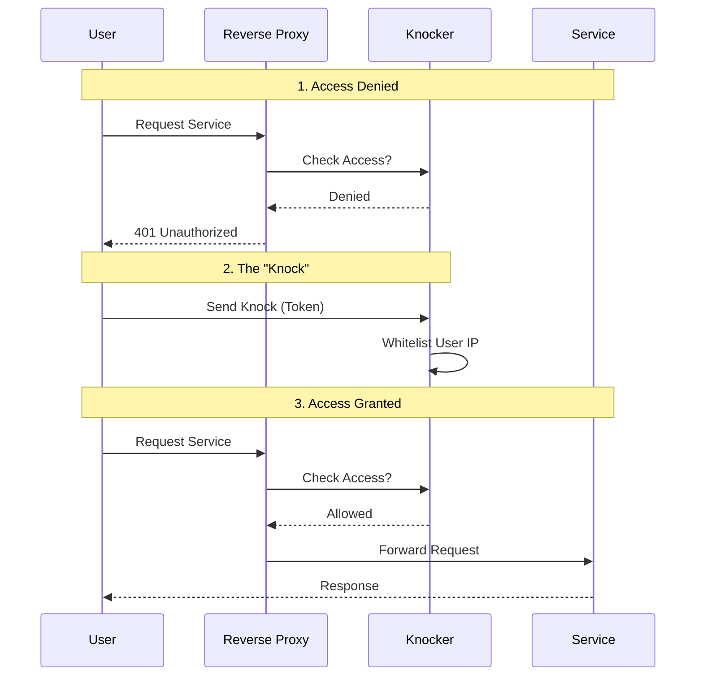
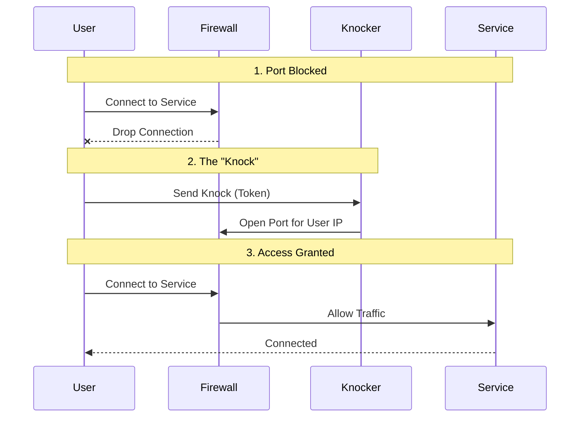
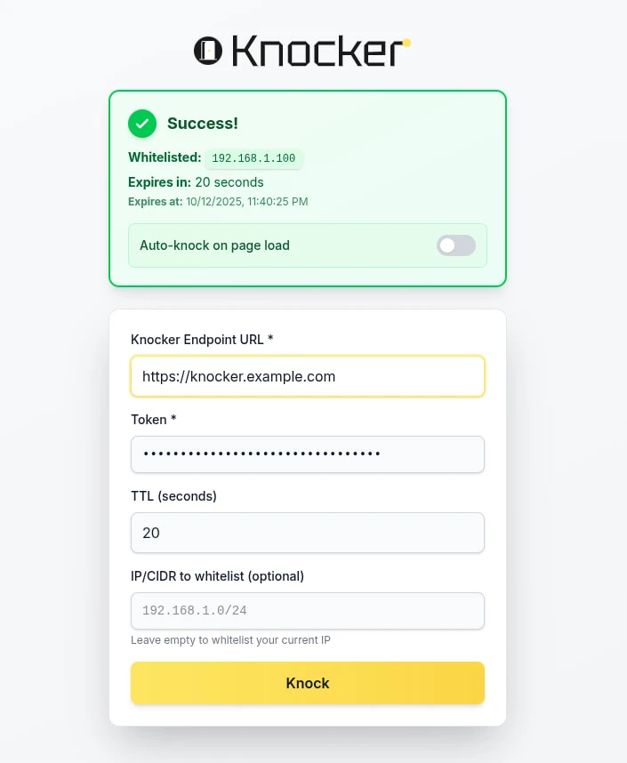
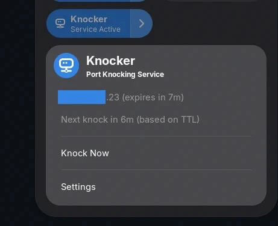

I have a homelab, but accessing it from outside my home network was always a pain. I didn't want to deal with the hassle of toggling VPNs on every device just to watch something on Jellyfin, so I created Knocker!

It's a knock-based access control service for your homelab that actually works with mobile apps with clients on most platforms used by homelabbers.

<!-- markdownlint-disable MD033 -->

<!-- markdownlint-enable MD033 -->

## How does it work?



By being completely transparent for whitelisted IPs, Knocker doesn't break API clients like mobile apps. Once you whitelist your IP, you are ready to go. You can even whitelist an IP other than your own if needed.

### Knocker Tokens

Knocker works by using tokens as passwords. Each token has specific permissions, like a customizable max TTL (capped server-side) and an option to allow whitelisting IPs other than your own.

By connecting Knocker to your reverse proxy, Knocker will analyze the request IP. Depending on the local whitelists, it will either return a `200 OK` or a `401 Unauthorized` status, which is then forwarded to the end client.

## Why Not Just Use a VPN?

I already use Tailscale. In fact, the IP of my homelab is the Tailscale IP because I added custom routes for it.

But using a VPN for everything is annoying. You have to install it on every single device, which is a nightmare on things like Smart TVs. Plus, keeping the Tailscale app running on Android drains my battery like crazy.

With Knocker, you just need one device to knock, and thanks to NAT, your whole network gets access.

### Is this as secure as a VPN?

**No.**

Knocker is a compromise. It trades some security for a lot of convenience. You can't whitelist specific devices, only Source IPs (which might be shared CGNAT IPs).

You're basically making a bet that within that short whitelist window, the likelihood of a hacker scanning your specific port and attacking it is pretty slim.

That's why you should use short TTLs on public networks. In general, Knocker should be used in front of services that already have their own authentication.

## Setup

Knocker is distributed as a Docker container that optionally uses the system DBus socket to interact with the FirewallD daemon.

docker.compose.yml: [https://github.com/FarisZR/knocker/blob/main/docker-compose.yml](https://github.com/FarisZR/knocker/blob/main/docker-compose.yml)

### knocker.yaml

```yaml
server:
  host: "0.0.0.0"
  port: 8000
  trusted_proxies:
    # Trust the IPv4 and IPv6 subnets of the caddy_net docker network
    # Adjust these to match your specific Docker network configuration.
    - "172.16.238.0/24"
    - "fd00:dead:beef::/64"

cors:
  allowed_origin: "https://knocker.fariszr.com"  # SECURITY: Set to your Knocker webapp's origin if you are hosting your own.

security:
  always_allowed_ips:
    # These IPs/CIDRs are always allowed to pass through the /verify endpoint
    # without needing to be dynamically whitelisted.
    # It's recommended to include your reverse proxy's IP here.
    - "172.16.238.0/24"
    - "fd00:dead:beef::/64"
    # Also your home's local network
    - "192.168.1.0/24"
  excluded_paths:
    # Request paths that start with any of these values will bypass
    # the IP whitelist check entirely.
    # Example:
    # - "/api/v1/status"
    # - "/metrics"
    - "/knock"
  # Maximum number of entries in the whitelist (default: 10000)
  max_whitelist_entries: 10000

whitelist:
  # The path where the whitelist file will be stored.
  # This path is relative to the container's file system.
  # The docker-compose.yml file will mount a volume to this location.
  storage_path: "/data/whitelist.json"

api_keys:
  - name: "admin-key-for-remote-whitelisting"
    key: "CHANGE_ME_SUPER_SECRET_ADMIN_KEY"  # SECURITY: Change this to a strong, random key
    max_ttl: 3600  # Maximum TTL in seconds (1 hour)
    allow_remote_whitelist: true  # Can whitelist other IP/CIDR specified in request body
```

### Connecting Your Reverse Proxy to Knocker

I use Caddy, but Knocker should work with any reverse proxy that supports using an external auth endpoint.

```caddy
# Define a reusable snippet for the knock-knock check.
# It points to the knocker service using Docker's internal DNS.
(knocker_auth) {
  forward_auth knocker:8000 {
    uri /verify?
    copy_headers X-Forwarded-For
  }
}

# The public endpoint for performing the knock.
# Make sure this domain points to your Caddy server's IP.
knock.your-domain.com {
  reverse_proxy knocker:8000
}

# An example protected service.
jellyfin.your-domain.com {
  import knocker_auth  # Apply the forward_auth check
  reverse_proxy jellyfin_service_name:8096
}
```

Now your service will respond with a `401 Unauthorized` for every non-whitelisted IP.

## FirewallD Integration

Knocker has another trick up its sleeve: it can integrate with FirewallD to operate on the firewall level, allowing you to use it for non-HTTP services like a game server!



<!-- markdownlint-disable MD033 -->

<!-- markdownlint-enable MD033 -->

There is a caveat, though: **exposed Docker Ports will still bypass these rules.**
Unfortunately, there isn't any firewall that deals with Docker port forwarding rules well.
You have to use host networking mode for it to work.

```yaml
firewalld:
  enabled: true 
  zone_name: "knocker" 
                        # WARNING: Zone won't be cleaned up automatically on shutdown
  zone_priority: -100  # Zone priority (negative numbers = higher priority)
  # zone_target: "default"  # Optional: Set the zone target (default: not set)
                            # Options: "default", "ACCEPT", "REJECT", "DROP"
                            # "default" = practically matches reject behavior
                            # "ACCEPT" = Accept all packets not matched by rules set by knocker
                            # "REJECT" = Reject all packets not matched by rules set by knocker
                            # "DROP" = Silently drop all packets not matched by rules set by knocker
  default_action: "drop"  # Action for blocked traffic on monitored ports:
  monitored_ports:
    # Only these ports will be protected by knocker firewall rules
    - port: 80
      protocol: tcp
    - port: 443
      protocol: tcp
    - port: 22
      protocol: tcp
  monitored_ips:
    # WARNING: Using 0.0.0.0/0 or ::/0 applies DROP/REJECT rules to ALL traffic
    - "203.0.113.0/24"        # Example WAN IPv4 range - CHANGE THIS
    - "2001:db8:1234::/48"    # Example WAN IPv6 range - CHANGE THIS
```

## Clients

The strong point of Knocker, and where I actually spent most of my time, is the clients.
I designed them to get out of the way as much as possible.

### Knocker-Web

[GitHub.com/FarisZR/Knocker-Web](https://github.com/FarisZR/Knocker-Web)



Knocker Web is a web client built with Vite.
It's fully static and can be installed as a PWA. It's meant to be the primary client, as it works basically everywhere.

What makes it really convenient is the "knock on reload" feature.
You just open the site and that's it; you don't care what happens after that.
It's especially useful when used as a PWA, as it means it will perform a knock when opened.

### Knocker-CLI

[GitHub.com/FarisZR/knocker-CLI](https://github.com/FarisZR/knocker-CLI)

A CLI client written in Go with support for creating a background service for periodic knocks using Systemd/LaunchAgent.

```sh
>> knocker --help
A reliable, cross-platform service that keeps your external IP address whitelisted.
It runs in the background, detects IP changes, and ensures you always have access.

Usage:
  knocker [flags]
  knocker [command]

Available Commands:
  completion  Generate the autocompletion script for the specified shell
  help        Help about any command
  install     Install the Knocker service
  knock       Manually trigger a whitelist request
  run         Run the Knocker service
  start       Start the Knocker service
  status      Get the status of the Knocker service
  stop        Stop the Knocker service
  uninstall   Uninstall the Knocker service

Flags:
      --check_interval int    Interval in minutes to poll for IP changes (only used when ip_check_url is set) (default 5)
      --config string         config file (default is $HOME/.knocker.yaml)
  -h, --help                  help for knocker
      --ip_check_url string   URL of the external IP checker service
      --ttl int               Time to live in seconds for the knock request (0 for server default)
  -v, --version               version for knocker

Use "knocker [command] --help" for more information about a command.
```

#### Knocker-Gnome

[GitHub.com/FarisZR/knocker-Gnome](https://github.com/FarisZR/knocker-Gnome)



An experimental Gnome extension that interprets the JSON logs output by Knocker-CLI, and allows you to manually trigger knocks, disable the service, and see the timeout for the current knock.

### Knocker-EXPO

[GitHub.com/FarisZR/knocker-expo](https://github.com/FarisZR/knocker-expo)



An experimental Android App built using React EXPO.
It does the same thing as the PWA, with support for creating a background service to regularly create knocks.

However, its reliability depends on the manufacturer, as not all of them actually allow Android background processes to run reliably.

## Vibe Coded with AI

Thanks to the Roo Code hackathon (sponsored by Requestly and Google), I finally had the excuse to build this.
I started with Gemini 2.5 Pro, burned through over $1700 in tokens, and eventually moved to GPT-5-CODEX and GitHub Coding Agent (Sonnet 4 later Sonnet 4.5) to build out features.

I used CodeRabbit for reviews and set up a full integration test environment for the agents to iterate against that's why this thing actually works at all.

I ran static analysis on the backend and found zero vulnerabilities, so there's that.

What im trying to see is, this is isn't your avg i told replit to code it project, but still if you are anti AI don't use this please.

I may go into more details about my workflow for implementing knocker using roo code in a separate blog post because it wasn't easy to go so far with Ai.
