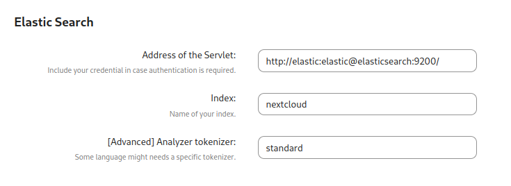

Setting up Nextcloud [full-text search](https://apps.nextcloud.com/apps/fulltextsearch) isn't very clear, especially with Docker, so in this post I'll explain how to set up full-text search with Elasticsearch and Tesseract using Nextcloud's official Docker images.

## add new tesseract to your Nextcloud container
Normally we would need to create a custom image for this, but fortunately [modzilla99](https://github.com/nextcloud/docker/issues/1414#issuecomment-884711124) and [Schw3pps](https://github.com/nextcloud/docker/issues/1414#issuecomment-1008915705) have found a way to add additional packages without needing a custom image, by adding a custom command to the container.

### latest/apache image
```yaml
command: sh -c "apt update && apt-get install -y --no-install-recommends tesseract-ocr tesseract-ocr-eng tesseract-ocr-$(YOUR_THREE_LETTER_LANGUAGE_CODE) && /entrypoint.sh apache2-foreground"
```
**TIP:** if you want to add Cron, you don't need a separate container, just add supervisor
```yaml
command: sh -c "apt update && apt-get install -y --no-install-recommends tesseract-ocr tesseract-ocr-eng tesseract-ocr-$(YOUR_THREE_LETTER_LANGUAGE_CODE) && mkdir -p /var/log/supervisord && mkdir -p /var/run/supervisord supervisor && supervisord -c /supervisord.conf"
```
make sure to mount [this file](https://github.com/nextcloud/docker/blob/master/.examples/dockerfiles/full/apache/supervisord.conf) at `/supervisord.conf`

### fpm-alpine image
```yaml
command: -c "apk add --no-cache tesseract-ocr tesseract-ocr-data-eng tesseract-ocr-data-$(YOUR_THREE_LETTER_LANGUAGE_CODE); /entrypoint.sh php-fpm"
```
and if you have a separate Cron container, add this to it:
```yaml
command: -c "apk add --no-cache tesseract-ocr tesseract-ocr-data-eng tesseract-ocr-data-$(YOUR_THREE_LETTER_LANGUAGE_CODE); /cron.sh"
```

## Elasticsearch setup

### docker-compose.yml
Add this to your Nextcloud compose file

**To avoid any problems, make the Nextcloud container depends on Elasticsearch, to make sure it's started before Nextcloud**

```yaml
services:
  elasticsearch:
    image: docker.elastic.co/elasticsearch/elasticsearch:7.17.10
    networks:
      default:
    # ports:
    # 127.0.0.1:9200:9200 #only needed if you are connecting through a docker network
    command: sh -c "bin/elasticsearch-plugin install --batch ingest-attachment; /bin/tini -s /usr/local/bin/docker-entrypoint.sh eswrapper"
    restart: always
    environment:
      - discovery.type=single-node
      - bootstrap.memory_lock=true
      - "ES_JAVA_OPTS=-Xms512m -Xmx2048m"
    user: 1000:1000
    ulimits:
      memlock:
        soft: -1
        hard: -1
    volumes:
      - elasticsearch:/usr/share/elasticsearch/data

volumes:
    elasticsearch:
```

Using the same trick as before, we can install the `ingest-attachment` plugin without the need for a custom image.
There will be an error when the container is restarted as it tries to install the plugin again, but it should continue to work fine.

## Nextcloud setup
Select Elasticsearch as the search platform, then add the server address.
If your language requires a custom tokenizer, feel free to change it.


The other options below aren't very important and can be configured to your liking.

## Start indexing!
Test setup
```bash
./occ fulltextsearch:test
```
index all files
```bash
./occ fulltextsearch:index
```
## automatic indexing
The official wiki has a section on using cron for this:
https://github.com/nextcloud/fulltextsearch/wiki/Basic-Installation#live-index-service

But since we are using docker, probably with supervisord added, [robeatoz](https://github.com/nextcloud/fulltextsearch/issues/671) has found a way to add `fulltextsearch:live` to the [supervisord.conf](https://github.com/nextcloud/docker/blob/master/.examples/dockerfiles/cron/apache/supervisord.conf) file.

### fulltextsearch.sh
create a new file called `fulltextsearch.sh`
```bash
#!/bin/sh
# Stop all running indexes
php /var/www/html/occ fulltextsearch:stop
# Start live index
php /var/www/html/occ fulltextsearch:live

# More information: https://github.com/nextcloud/fulltextsearch/wiki/Commands
```

### supervisord.conf

Add this to the end of the file
```supervisor
[program:fulltextsearch_index_live]
stdout_logfile=/dev/stdout
stdout_logfile_maxbytes=0
stderr_logfile=/dev/stderr
stderr_logfile_maxbytes=0
user=www-data
command=/bin/sh /fulltextsearch.sh
```

### docker-compose.yml
mount `fulltextsearch.sh` into the container
```yaml
volumes:
  - ....
  - ./fulltextsearch.sh:/fulltextsearch:ro
```
And you are done!

## sources
https://github.com/nextcloud/docker/issues/1724
