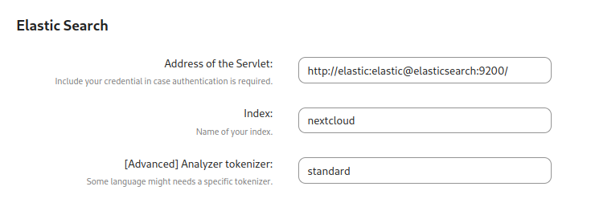

كيفية تشغيل [البحث النصي الشامل](https://apps.nextcloud.com/apps/fulltextsearch) في Nextcloud, خاصه عند استخدام Docker والبحث باللغة العربية غير واضحه.
لذلك كتبت هذا الشرح, ليشرح كيفيه تشغيله, مع استخدام Docker, Elasticsearch و Tesseract, ودعم العربية.

**هذا المقال متوفر ايضا على مجتمع أسس [هنا](https://discourse.aosus.org/t/topic/2813)**

## أضف tesseract لحاوية Nextcloud
المعتاد عند اضافة اي شيء لحاوية دوكر, ان تقوم بعمل صورة مخصصة, لكن [modzilla99](https://github.com/nextcloud/docker/issues/1414#issuecomment-884711124) و [Schw3pps](https://github.com/nextcloud/docker/issues/1414#issuecomment-1008915705) اكتشفو طريقة لإضافة الحزم دون الحاجة لصورة مخصصه, وهي عبر وضع أمر 
`command` مخصص للحاوية.

### latest/apache صورة
```yaml
command: sh -c "apt update && apt-get install -y --no-install-recommends tesseract-ocr tesseract-ocr-eng tesseract-ocr-ara tesseract-ocr-$(YOUR_THREE_LETTER_LANGUAGE_CODE) && /entrypoint.sh apache2-foreground"
```
**ملاحظة:** إذا كنت تريد إضافة Cron, لا تحتاج حاوية منفصله, استخدم supervisor
```yaml
command: sh -c "apt update && apt-get install -y --no-install-recommends tesseract-ocr tesseract-ocr-eng tesseract-ocr-ara tesseract-ocr-$(YOUR_THREE_LETTER_LANGUAGE_CODE) && mkdir -p /var/log/supervisord && mkdir -p /var/run/supervisord supervisor && supervisord -c /supervisord.conf"
```
تأكد من وصل [هذا الملف](https://github.com/nextcloud/docker/blob/master/.examples/dockerfiles/full/apache/supervisord.conf) للحاوية ك`/supervisord.conf`

### fpm-alpine صورة
```yaml
command: -c "apk add --no-cache tesseract-ocr tesseract-ocr-data-eng tesseract-ocr-data-ara tesseract-ocr-$(YOUR_THREE_LETTER_LANGUAGE_CODE); /entrypoint.sh php-fpm"
```
واذا تستخدم حاوية منفصله لCron, اضف هذا لها
```yaml
command: -c "apk add --no-cache tesseract-ocr tesseract-ocr-data-eng tesseract-ocr-data-ara tesseract-ocr-$(YOUR_THREE_LETTER_LANGUAGE_CODE); /cron.sh"
```

## إعداد Elasticsearch

### docker-compose.yml
اضف هذا لنفس مِلَفّ الذي تستخدم لتشغيل Nextcloud

**لتجنب اي مشاكل, تأكد ان Nextcloud يعتمد على Elasticsearch, حتى يتم تشغيله قبل ان يتم تشغيل Nextcloud**

```yaml
services:
  elasticsearch:
    image: docker.elastic.co/elasticsearch/elasticsearch:7.17.10
    networks:
      default:
    # ports:
    # 127.0.0.1:9200:9200 #only needed if you are connecting through a docker network
    command: sh -c "bin/elasticsearch-plugin install --batch ingest-attachment; /bin/tini -s /usr/local/bin/docker-entrypoint.sh eswrapper"
    restart: always
    environment:
      - discovery.type=single-node
      - bootstrap.memory_lock=true
      - "ES_JAVA_OPTS=-Xms512m -Xmx2048m"
    user: 1000:1000
    ulimits:
      memlock:
        soft: -1
        hard: -1
    volumes:
      - elasticsearch:/usr/share/elasticsearch/data

volumes:
    elasticsearch:
```

بنفس الطريقة السابقة, ننزل الإضافة`ingest-attachment` دون الحاجة لصورة مخصصه.

في حالة إعادة تشغيل الحاوية, سيكون هناك خطا لأنه سيحاول إعادة تثبيت الإضافة, لكنها ستكمل العمل.

## إعداد Nextcloud
أختر Elasticsearch كمنصة بحث
وإذا تحتاج احد اللغات ل Tokenizer مخصص, بإمكانك تغييره


الخيارات الأخرى غير مهمه, وبإمكانك تغييرها حسب احتياجاتك.

## أبدء بفهرسه الملفات
التأكد ان كل شيء يعمل
```bash
./occ fulltextsearch:test
```
فِهْرِس كل الملفات
```bash
./occ fulltextsearch:index
```
## الفهرسة التلقائية للملفات الجديدة

الشرح الرسمي فيه قسم مخصص لتشغيل الفهرسة التلقائيه بستخدام Cron:
https://github.com/nextcloud/fulltextsearch/wiki/Basic-Installation#live-index-service

لكن بما اننا نستخدم صورة دوكر, مع supervisor, شرح [robeatoz](https://github.com/nextcloud/fulltextsearch/issues/671) طريقة  لإضافة أمر `fulltextsearch:live` لملف [supervisord.conf](https://github.com/nextcloud/docker/blob/master/.examples/dockerfiles/cron/apache/supervisord.conf).

### fulltextsearch.sh
أنشئ ملف اسمه `fulltextsearch.sh`
```bash
#!/bin/sh
# Stop all running indexes
php /var/www/html/occ fulltextsearch:stop
# Start live index
php /var/www/html/occ fulltextsearch:live

# More information: https://github.com/nextcloud/fulltextsearch/wiki/Commands
```

### supervisord.conf

أضف هذا لنهاية الملف
```supervisor
[program:fulltextsearch_index_live]
stdout_logfile=/dev/stdout
stdout_logfile_maxbytes=0
stderr_logfile=/dev/stderr
stderr_logfile_maxbytes=0
user=www-data
command=/bin/sh /fulltextsearch.sh
```

### docker-compose.yml
أوصل ملف `fulltextsearch.sh` بالحاوية
```yaml
volumes:
  - ....
  - ./fulltextsearch.sh:/fulltextsearch:ro
```

والان اصبح لديك فهرسه تلقائيه لبحث نصي كامل!

## المصادر
https://github.com/nextcloud/docker/issues/1724
