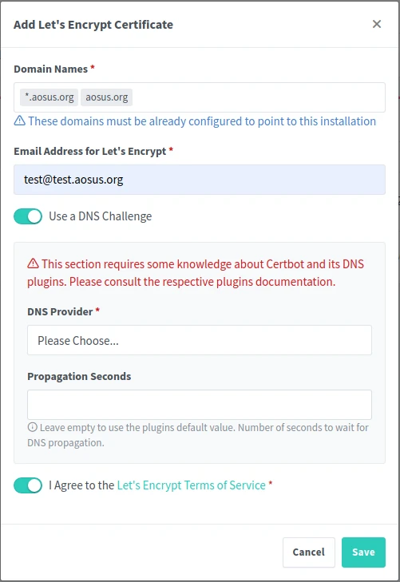
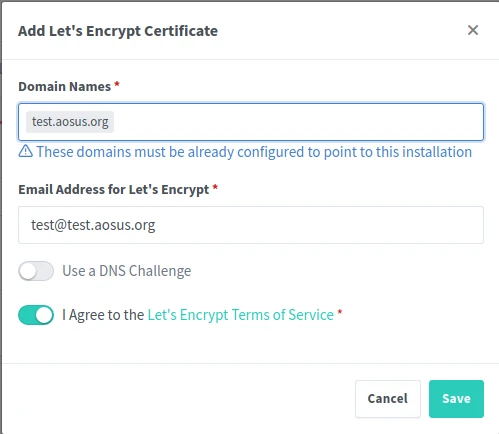
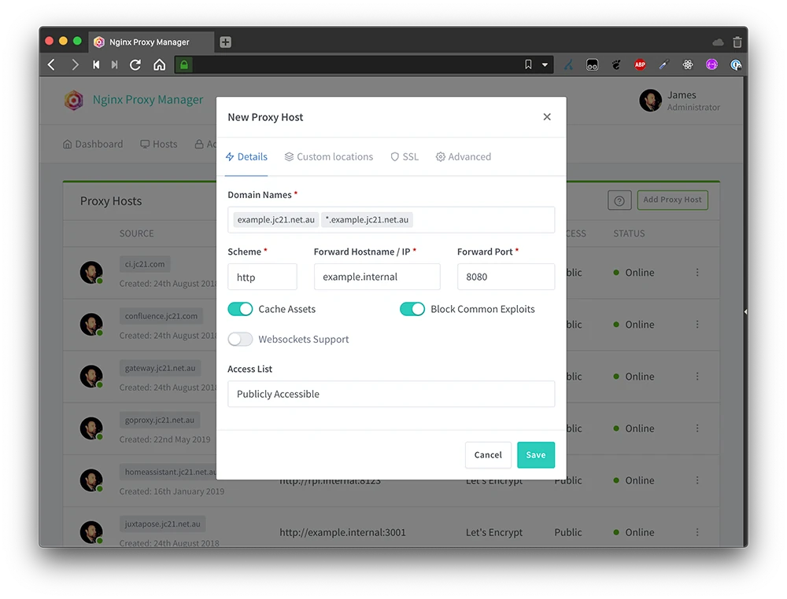

**هذا الموضوع كتب على [مجتمع أسس](https://discourse.aosus.org/t/topic/2148)**

السلام عليكم ورحمة الله وبركاته

اليوم سوف اشرح احد افضل برمجيات التي استخدمها لتشغيل العديد من خدمات الحاويات.
برنامج nginx proxy manager يقدم واجهه بسيطه لاداره العناوين والخدمات المربوطه بالخادم وايضا اداره شهادات SSL من Lets Encrypt.

## طريقة وصل الحاويات

هناك طريقتين لوصل الحاويات بخادم الويب

### شبكة Docker/Podman
بدلا من كشف الخدمة محليا, بامكانك انشاء شبكة محليه للحاويات.
يمكن للحاويات التواصل بين بعضهم عبر اسماء الحاويات مع DNS.


### فتح port الخدمات للخادم محليا
 مثلا `127.0.0.1:8000:5000`
في هذه الحاله الخدمة ستكشف port 8000 محليا على الجهاز, وهو port 5000 داخل الحاوية.


[details="اذا تستخدم Podman"]
تاكد من تثبيت حزمة `podman-plugins` و `dnsmasq` من اجل تفعيل dns داخل الشبكة.
كامل التفاصيل في موضوع [كيف تشغل docker-compose على Podman](https://discourse.aosus.org/t/topic/2140)
[/details]

معظم الوقت سوف تستخدم الطريقة الاولى, لانها اكثر امانا لانك لا تكشف شيء محليا, لكن في حاله كنت تشغل الحاويه بوضع Host من اجل اخذ افضل سرعه سوف تضطر لكشف الخدمات محليا.

في هذا الشرح سوف نتبع الطريقة الاولى.

## أنشاء شبكة Web
سوف نقوم بانشاء شبكة لكل الخدمات التي ستكون موصوله بخادم Nginx

### Docker
```
docker network create web
```
### Podman
```
podman network create web
```

## Docker-compose

انشى مجلد تحت اي اسم تريده, مثلا nginx
```
mkdir nginx
cd nginx
```
ثم انشئ ملف docker-compose.yml
```
networks:
  web:
    external: true

services:
  nginx:
    image: 'jc21/nginx-proxy-manager:latest'
    restart: always
    ports:
      # Public HTTP Port:
      - '80:80'
      # Public HTTPS Port:
      - '443:443'
      # لوحه التحكم Port:
      - '127.0.0.1:81:81'
    environment:
      DB_SQLITE_FILE: "/data/database.sqlite"
      # اذا كنت تريد تعطيل ipv6 فعل هذا الخيار
      # DISABLE_IPV6: 'true'
    volumes:
      - ./data:/data
      - ./letsencrypt:/etc/letsencrypt
    healthcheck:
      test: ["CMD", "/bin/check-health"]
      interval: 10s
      timeout: 3s
      retries : 3
    networks:
      web:
```

قم بتشغيل  الخدمه عبر امر 
### V1
```
docker-compose up -d
```
### V2
```
docker compose up -d
```

### دخول للوحة التحكم

لوحه التحكم موجوده على port 81 محليا داخل الخادم لذلك ستحتاج لأستخدام ssh tunnel.
```
ssh -N -L 8080:127.0.0.1:81 user@server
```
وستظهر لك اللوحه على `localhost:8080` في المتصفح.

الحساب الافتراضي هو 
User: `admin@example.com`
Password: `changeme`

## اصدار شهادة SSL
توجه لقسم SSL Certificates وثم اضغط على زر add SSL Certificate ثم اختر  Lets encrypt.

### طريقة Dns Challange
في حاله كان خادمك غير مكشوف للانترنت(خادم منزلي مثلا) او كنت تريد اصدار شهادة واحده لكل الخدمات بدلا من شهاده لكل عنوان فرعي.

فاذا كان مقدم ال dns الخاص بك يدعم Lets encrypt dns challenge بامكانك اصدار شهاده عبر مقدم ال dns بدون الحاجه لكشف الخادم, و الحصول على شهداه عامه لكل العناوين الفرعيه(wildcard).

[مقدمين DNS المدعومين في Lets encrypt](https://community.letsencrypt.org/t/dns-providers-who-easily-integrate-with-lets-encrypt-dns-validation/86438) انا انصح ب Desec.io لانها منظمة غير ربحية وتدعم dynamic dns.



قم بوضع العنوان + *.عنوان.tld بحيث تصبح الشهاده تشمل العنوان الاساسي وجميع العنواين الفرعية.
بعدها اختار مقدم ال  DNS الخاص بك و سيطلب منك api token, ويعتمد طريقه الحصول عليها على حسب كل مقدم.

بعد ذلك اضغط save واذا كان كل شيء صحيح ستظهر لك شهاده تشمل كل العنوان الخاص بك, بدون الحاجه لكشف خادمك!.


## طريقه ACME challenge


سيظهر لك هذا المربع عن تفاصيل الشهادة.
**يجب ان يكون الدومين(DNS) موجه لخادمك من قبل**

حدد العناوين التي تريد الشهادة ان تشملها(يجب ان تكون كلها موجهه لخادمك).
ثم ضع بريدك و ووافق على الشروط ثم اضغط على زر save.

هذه الطريقة اليدويه التي تعطيك شهاده على خادم مكشوف الانترنت مباشرة.

## اضافة الخدمات

بعد ذلك توجه ل proxy hosts وقم باضافه اول خدمه لك


ضع الدومين
ثم اسم الحاويه, تاكد من تحديد container name, واخذ هذا الاسم وضعه في hostname
ثم حدد ال port. بعض الخدمات تستخدم https داخليا لكن معظم الوقت http.

اذهب لصفحه SSL, اختار الشهاده التي تطبق على العنوان المستخدم, و اذا كنت تريد ان يستخدم Https بشكل افتراضي لتشفير جميع الاتصالات, قم باختيار Force ssl.

وهكذا اصبح لديك خادم Nginx جاهز وسهل لكل حاويات دوكر/بودمان.