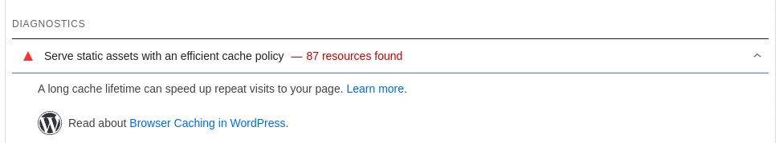

إذا ظهر لك تنبيه "Serve static assets with an efficient cache policy" في PageSpeed, تحتاج لإضافة  `Cache-Control` header لملفات موقعك الثابتة



هنا كيفية عمل هذا إذا كنت تستخدم خادم [Caddy](https://caddyserver.com)

## Cache-Control 
إذا كنت تريد تحديد `Cache-Control` header, للملفات الثابتة مثل , .js, .jpg, وغيرها, أضف هذا النص لملف Caddyfile الخاص بك, تحت قسم الموقع نفسه.

```
@static {
  file
  path *.ico *.css *.js *.gif *.webp *.avif *.jpg *.jpeg *.png *.svg *.woff *.woff2
}
header @static Cache-Control max-age=5184000
```

الملفات سيتم حفظها لمدة `5184000` ثانية, أي 60 يوم. وبإمكانك تعديل المدة حسب ما يناسبك.

## المصدر
https://caddy.community/t/correct-way-to-set-expires-on-caddy-2/7914/13