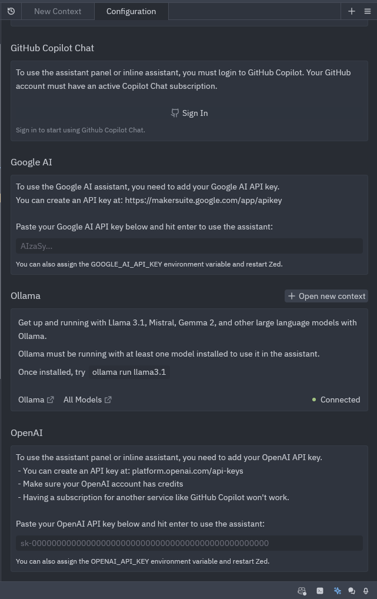
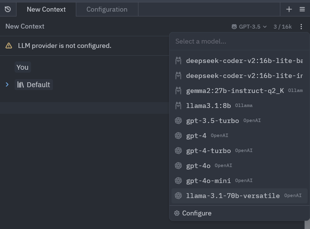

[Zed](https://zed.dev/) هو محرر نصوص جديد مع دعم ذكاء اصطناعي متقدم, يهدف لمنافسة محرر Cursor الشهر.

بامكانك استخدام [Zed Ai مجانا](https://zed.dev/blog/zed-ai) مع Claude 3.5 sonnet, الذي يعتبر من الافضل بالساحة.
لكن عليه حدود استخدام و سيتعلم على الاغلب على مدخلاتك.

لكن بامكانك استخدام Zed AI ايضا مع LLMs من OpenAI او حتى اي مقدم اخر اذا يستخدم واجهه برمجية تشابة OpenAI.

## settings.json
أعدادات Zed تدار عبر ملف `settings.json`, 
افتح الملف عبر اختصار `ctrl +,`

والصق هذه الاعدادات:

```json
{
  "language_models": {
    "openai": {
      "version": "1",
      "api_url": "https://api.groq.com/openai/v1",
      "available_models": [
        {
          "name": "llama-3.1-70b-versatile",
          "max_tokens": 131072,
          "max_output_tokens": null
        }
      ]
    }
  }
}
```

- **api_url**: رابط الواجهه البرمجية المتوافقة مع OpenAI, لgroq الرابط هو: `https://api.groq.com/openai/v1`

- **available_models**: هذه قائمة Json للموديلات المتوفرة, على Groq افضل LLM متوفر حاليا هو LLama 3.1 70b

## أضافة مفتاح API الخاص بك واستخدام الLLM الجديد



الصق مفتاح الAPI الخاص بك في الفراغ المخصص ل openAI.

بامكانك الحصول على [Groqcloud API token](https://console.groq.com/keys) عبر الذهاب لصفحة groq console ثم API keys.

أختر الLLM الخاص بك (سيكون بجانبة شعار openAI) والان اصبح لديك مساعد Zed AI مبني على LLAMA!



## المصادر
https://github.com/zed-industries/zed/pull/13276