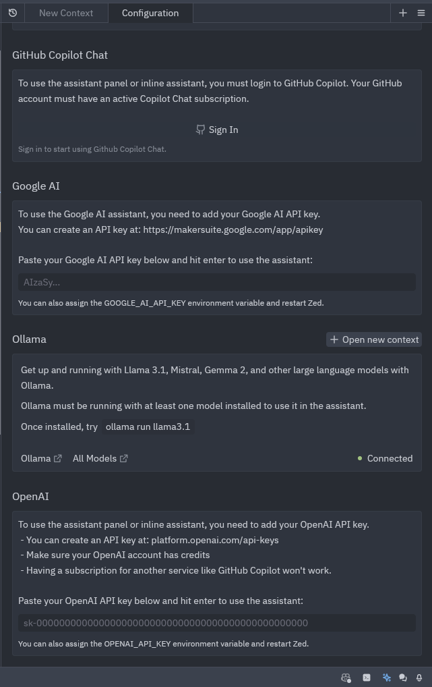
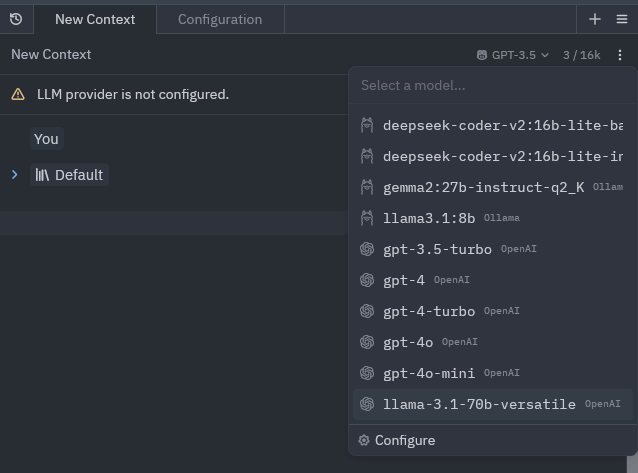

[Zed](https://zed.dev/) is a new open source code editor on the block, which has a top-notch Ai integration, aiming to compete with Cursor.

You can use [Zed Ai for free](https://zed.dev/blog/zed-ai), it will use Claude 3.5 sonnet with strict rate limits, and it also may use your Inputs for training.

However you can also run Zed AI using openAI LLMs or even any other LLM running on an openai api-compatible provider like groq!

## settings.json
Zed's settings are mainly managed through the settings.json file.
Open the file using the shortcut `ctrl +,`

And paste the following:

```json
{
  "language_models": {
    "openai": {
      "version": "1",
      "api_url": "https://api.groq.com/openai/v1",
      "available_models": [
        {
          "name": "llama-3.1-70b-versatile",
          "max_tokens": 131072,
          "max_output_tokens": null
        }
      ]
    }
  }
}
```

- **api_url**: openai compatible API url, for groq it's `https://api.groq.com/openai/v1`

- **available_models**: this is a json array of all models from this provider, the best available model on groq is LLama 3.1 70b

## storing your API token and enabling choosing custom LLM model



Enter your API token for Groq or your preferred OpenAI-compatible platform in the OpenAI modal at the end of the zed ai configure page.

You can generate your [Groqcloud API token](https://console.groq.com/keys) by going to the groq console page and then to api keys

then choose your custom LLM model (it's going to have an OpenAI logo next to it, sorry!) and now you should have a Llama-powered Zed AI assistant!




## sources
https://github.com/zed-industries/zed/pull/13276