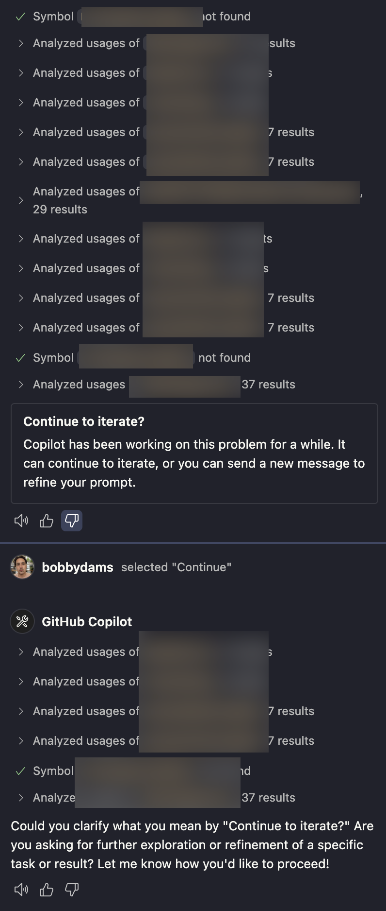

Over the past few weeks, I've been vibecoding a new app with GitHub Copilot.

I know it's not meant for that, but here's what I learned anyway:

## 200 requests are actually a lot

The GitHub Copilot pro sub includes 200 premium requests and unlimited gpt4.1 and gpt-4o requests.

It's genuinely a lot, especially considering o4-mini's 0.33x multiplier. It's great for debugging but not ideal for designing.

Don't forget that the Copilot coding agent on GitHub uses only one premium request for the entire session.

### Not enough with third party extensions

Cline and its forks added support for using copilot as a provider through the VS Code LM API.

However, the way these requests are handled differs significantly. A request in the official plugin is an interaction, every action done by LLM till it stops generating is included in that request.

However, when third party extensions do this each API request counts as a premium request on its own, meaning instead of using one premium request to do the entire generation workflow, it's using 5 to 10.

That's at least the case with Cline based tools.

## Limited context window

All Copilot models are capped at a [64k context window](https://github.com/microsoft/vscode-copilot-release/issues/8303#issuecomment-2835038819), which is disappointing, especially for Gemini models that shine with their 1m context window.

(maybe that's not the case for the async coding agent?)

## The Continue to iterate prompt is a disaster

This is the worst thing in GitHub Copilot, it shows up when it's actually doing work and stops the agent.

This wouldn't be a problem if the LLM actually just continued iterating, but due to the limited context window it seems to get only a summary of the chat and just starts anew.

It's very annoying, but luckily there's a fix, you can increase the request limit, so that it practically never shows up

## Context7 MCP is OP

Context7 is an MCP that enables the LLM to fetch up-to-date documentation in Markdown for almost any library out there. Adding it is crucial as it prevents the model from hallucinating or using outdated functions.

Sonnet 4 especially excelled at this, it always used context7 before doing anything, or while debugging.

Other models like o4-mini needed to be reminded explicitly for them to actually use it, either by text or by adding it to the context window.

## Stagewise MCP is superb for editing UI elements

[Stagewise](https://stagewise.io/) is an MCP client that adds an npm dev module that allows you to select elements and forward them to Copilot.

This makes adjusting frontend elements much easier.

## Generating copilot.md instructions is actually useful

Copilot can now generate a `copilot-instructions.md` file for itself.

It might sound odd, but it works by providing the LLM with a general project overview, which you can build on with additional instructions.

## One long, detailed prompt is way better than refining things later, especially for the Copilot coding agent

This could be a side effect of the small context window, but there's a huge difference when actually starting with a fully detailed prompt.

The LLM generates based on its assumptions. The more detailed you are, the better these assumptions align with your expectations.

It's the reason why I think Kiro.dev will excel in this, because it unpacks these assumptions into separate markdown files, which then you can refine.

if you want to use the GitHub Copilot async coding agent, you can trigger it from the chat which will do a search and then write a really detailed prompt.
The Results are way better than usual with this.

In general, it's been decent, but most of the issues really stem from the limited 64k context window, it makes Gemini models almost useless.

However, Copilot's access to GitHub has been a strong point.